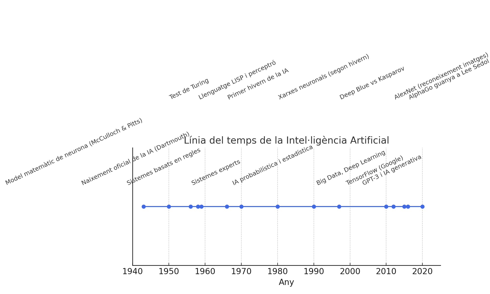
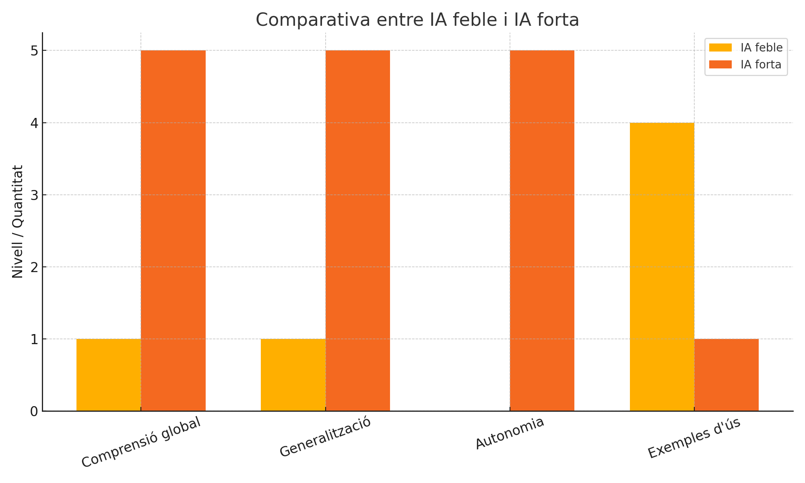
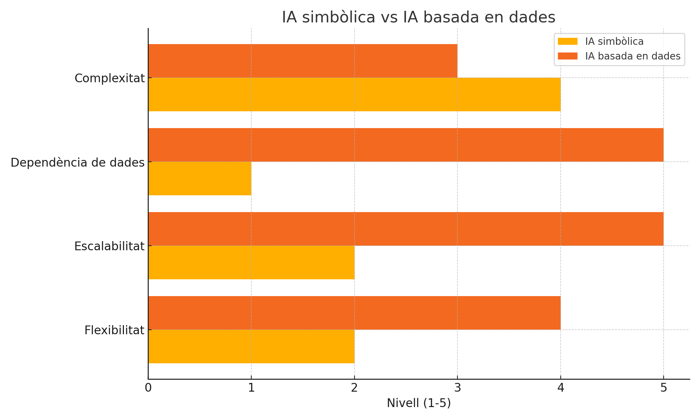

---
# Informació general del document
title: Introducció a la Intel·ligència Artificial
subtitle: 
authors: 
    - Departament d'informàtica
lang: ca
page-background: img/bg.png

# Portada
titlepage: true
titlepage-rule-height: 0
# titlepage-rule-color: AA0000
# titlepage-text-color: AA0000
titlepage-background: img/portada.png
# logo: img/logotext.png

# Taula de continguts
toc: true
toc-own-page: true
toc-title: Continguts

# Capçaleres i peus
header-left: Unitat 01 - Introducció a la Intel·ligència Artificial
header-right: Curs 2025-2026
footer-left: IES Jaume II El Just
footer-right: \thepage/\pageref{LastPage}

# Imatges
float-placement-figure: H
caption-justification: centering

# Llistats de codi
listings-no-page-break: false
listings-disable-line-numbers: false

header-includes:
     - \usepackage{lastpage}
---

# Introducció a la intel·ligència Artificial

En esta primera unitat anem a introduir conceptes bàsics sobre intel·ligència artificial i models d'IA. La introducció serà comuna als mòduls de **Models d'Intel·ligència Artificial** i **Sistemes d'Aprenentatge Automàtic**, per la qual cosa molts conceptes es repetiran en ambdós mòduls.

## Definició i conceptes bàsics

Una primera definició d'**intel·ligència artificial (IA)** podria ser la següent: ***habilitat per aprendre i resoldre problemes duta a terme per una màquina o programari***.

Si entenem com IA la capacitat d'una màquina per a simular processos d'intel·ligència humana, podem establir almenys tres punts clau:

- **Aprenentatge**: La IA ha de ser capaç d'aprendre de l'experiència, tant inicialment a partir d'unes regles / dades inicials, com millorant el seu rendiment a mesura que s'exposa a més dades o situacions (**autocorrecció**).
- **Raonament**: La IA ha de ser capaç de raonar i prendre decisions basades en la informació disponible, utilitzant lògica i coneixements previs.
- **Resolució de problemes**: La IA ha de ser capaç de resoldre problemes complexos i adaptar-se a noves situacions, utilitzant estratègies i tècniques adequades.

Una **màquina intel·ligent**, és a dir, capaç de realitzar les tasques dites anteriorment, seria un agent flexible que percep el seu entorn i porta a terme accions que maximitzen les seues possibilitats d'èxit en objectius i tasques concretes.

El concepte d'intel·ligència artificial (IA) no és el mateix ara que fa, per exemple, 50 anys. En unes dècades hem passat d'unes màquines que eren capaces de realitzar càlculs senzills a sistemes que poden aprendre, raonar i prendre decisions complexes. Els objectius també han anat canviat al llarg del temps. En un principi eren molt ambiciosos, però no existia la tecnologia necessària. Poc a poc els objectius s'han anat fent més realistes i adaptant-se a la tecnologia existent en cada moment. 

Així, des dels anys 60 hem passat d'un objectiu inicial que pretenia replicar el procés de la intel·ligència humana, a uns altres més pragmàtics i concrets. Els avanços que s'han produït tant en el camp de la IA com en el hardware i software necessaris, han fet que tornem a mirar endavant amb més ambició. La idea de crear màquines que puguen pensar i actuar com humans ha evolucionat cap a la creació de sistemes que poden aprendre i adaptar-se a noves situacions, processar grans volums de dades i resoldre problemes complexos de manera autònoma, però sense perdre de vista la possibilitat d'arribar a que la IA puga raonar, aprendre i actuar con un ésser humà; fins i tot, que puga superar les capacitats humanes en certes tasques.

És per això que tenim, com veurem més endavant, diferents enfocaments i tipus d'intel·ligència artificial, que van des de la **IA feble**, que es centra en tasques específiques i limitades, fins a la **IA forta**, que pretén replicar la intel·ligència humana en tota la seua complexitat.

> Fins i tot una eina com chatGPT, que sembla que sap fer de tot, és realment una IA feble centrada bàsicament en una única tasca: processament del llenguatge. Tornarem més endavant sobre este concepte.

## Història i evolució de la IA

Encara que semble que la intel·ligència artificial és un concepte recent, les seues arrels es remunten a fa més de 70 anys. En esta unitat farem un repàs breu de la història i l'evolució de la IA, des dels seus inicis fins als avanços més recents.

- 1943: Warren McCulloch i Walter Pitts publiquen [un article](https://lamaquinaoraculo.com/deep-learning/el-modelo-neuronal-de-mcculloch-y-pitts/) que proposa un model matemàtic per a les neurones, establint les bases de les xarxes neuronals. 
- 1950: Alan Turing proposa el Test de Turing, un criteri per a determinar si una màquina pot exhibir un comportament intel·ligent indistinguible del d'un ésser humà.
- 1956: En la Conferència de Dartmouth, John McCarthy, Marvin Minsky i altres investigadors defineixen el terme "intel·ligència artificial" i estableixen les bases per a la investigació en este camp.
- 1958: Se desenvolupa el llenguatge de programació LISP, que es converteix en un dels llenguatges més utilitzats en la investigació d'IA. També apareix el perceptrón, un algorisme de xarxa neuronal proposat per Frank Rosenblatt per a reconeixement de patrons. Concretament, s'utilitzava per a reconèixer formes simples i classificar imatges.
- 1959: Desenvolupament dels primers sistemes d'IA que utilitzaven regles per a resoldre problemes matemàtics i demostrar certs teoremes.
- 1960s: Se desenvolupen els primers sistemes d'IA especialitzats, com ELIZA, un programa de processament del llenguatge natural que simulava una conversa amb un terapeuta, ordinadors que juguen als escacs, sistemes que resolen problemes matemàtics... Sempre tasques molt específiques i limitades.
- 1966-1970: els resultats estan per baix de les expectatives i es produeix un primer període de desencantament amb la IA, conegut com "l'hivern de la IA". Els investigadors es donen compte que les expectatives inicials eren massa altes i que els avanços són més lents del que s'esperava. Se reajusten els objectius.
- 1970s: S'investiga en sistemes basats en el coneixement, com els sistemes experts, que utilitzaven regles i coneixements específics per a resoldre problemes en àrees com la medicina o l'enginyeria. 
- 1980s: S'inicia un segon període d'interès per la IA, impulsat per l'augment de la potència de càlcul i el desenvolupament de noves tècniques d'aprenentatge automàtic. Se torna a investigar en xarxes neuronals hi ha avanços, però els models són molt complexos i necessiten supervisió constant i ajustos manuals. Segon hivern de la IA.
- 1990s i 2000s: IA moderna, basada en probabilitat i estadística, que permet arribar a conclusions futures a partir de dades passades. Models basats en dades, més flexibles que els models simbòlics.
- 1997: Hui sembla una anècdota, però l'ordinador Deep Blue d'IBM guanya al campió mundial d'escacs Garry Kasparov, marcant un moment històric en la IA.
- 2010s: la gran quantitat de dades i les tècniques de tractament (Big Data), així com la computació al núvol (menys necessitat de recursos locals), permeten l'ús de models d'aprenentatge profund (Deep Learning) i xarxes neuronals convolucionals, que han revolucionat la IA en àrees com la visió per computador i el processament del llenguatge natural.
- Algunes fites dels darrers anys:
  - 2011: IBM Watson guanya el concurs de preguntes i respostes Jeopardy!, demostrant la capacitat de processar i entendre el llenguatge natural.
  - 2012: AlexNet guanya la competició ImageNet, demostrant l'eficàcia de les xarxes neuronals profundes en el reconeixement d'imatges.
  - el vídeo dels 500 milions de dòlars de DeepMind: Deep-Q aprenent a jugar el joc Atari Breakout. [enllaç per veure el video](https://www.youtube.com/watch?v=V1eYniJ0Rnk)
  - 2015: Google allibera el seu sistema d'IA, **TensorFlow**, que es converteix en un dels marcs més utilitzats per a l'aprenentatge automàtic i les xarxes neuronals.
  - 2016: AlphaGo, desenvolupat per DeepMind, guanya al campió mundial de Go, un joc extremadament complex.
  - 2020: GPT-3, un model de llenguatge natural desenvolupat per OpenAI, demostra una capacitat sorprenent per a generar text coherent i realista que ha anat millorant molt des d'aleshores. Utilitza 175 mil milions de paràmetres i és capaç de realitzar una àmplia gamma de tasques de processament del llenguatge natural, com traducció, resum, generació de text i resposta a preguntes. OpenAI no ha donat informació de quants paràmetres té el model GPT-4, tot i que certes fonts parlen de 250 mil millions. GPT-5 podria tindre més d'un bilió de paràmetres.
  - 2021: DALL-E, un model generatiu d'imatges desenvolupat per OpenAI, que pot generar imatges a partir de descripcions textuals.
  - 2022-2025: Agents intel·ligents com **DeepSeek**, **Gemini** (Google), **NotebookLM** (Google), **Claude** (Anthropic)... que combinen models de llenguatge amb altres capacitats, com la visió per computador, la raonament lògic i la planificació. 
  - Capacitat de generar imatges, vídeos i àudio de manera realista, com DALL-E, Stable Diffusion, Midjourney... [Imatges de rostres humans inexistents](https://thispersondoesnotexist.com/).
  - ***Deep Learning**: una branca de l'aprenentatge automàtic del que analitzarem més detalladament en el mòdul de **Sistemes d'Aprenentatge Automàtic**, on estudiarem també els diferents tipus d'aprenentatge automàtic (supervisat, no supervisat, per reforç).

## Tipus d'intel·ligència artificial

La intel·ligència artificial es pot classificar en diferents tipus segons el seu enfocament i les seues capacitats. En este apartat, veurem els principals tipus d'IA, des de la IA feble fins a la IA forta, i les seues característiques distintives.

### IA feble

La **IA feble**, també coneguda com a **IA estreta (narrow AI)**, es refereix a sistemes d'intel·ligència artificial dissenyats per a realitzar tasques específiques i limitades. Estos sistemes no tenen consciència ni comprensió general del món, sinó que estan enfocats en resoldre problemes concrets. Són reactius, la qual cosa vol dir que no tenen iniciativa sino que reaccionen a certes ordres o accions. No "aprenen" com un ésser humà: "entrenen" amb dades o per amb moltes proves/errors.

Alguns exemples d'IA feble inclouen:

- Assistents virtuals com Siri o Alexa, que poden respondre preguntes i realitzar tasques senzilles.
- Algoritmes de recomanació en plataformes com Netflix o Amazon, que suggereixen contingut basat en les preferències de l'usuari.
- Sistemes de reconeixement de veu i imatge, que poden identificar patrons en dades específiques.   

Com podeu veure, la IA feble és la que s'ha estat desenvolupant i utilitzant en els darrers anys, i és la que trobem en la majoria de les aplicacions d'IA actuals. La seua limitació és que no pot generalitzar coneixements ni aprendre de manera autònoma fora del seu àmbit específic. Per tal de poder superar els "hiverns de la IA", se va apostar per este enfocament més pragmàtic i realista.

### IA forta

La **IA forta**, també coneguda com a **IA general (general AI)**, es refereix a sistemes d'intel·ligència artificial que tenen la capacitat de comprendre, aprendre i aplicar coneixements en una àmplia gamma de tasques, similar a la intel·ligència humana. Estos sistemes podrien raonar, planificar, resoldre problemes i adaptar-se a noves situacions sense necessitat d'intervenció humana constant. En teoria serien proactives, és a dir, no necessitarian una ordre o un ésser humà demanant-li una tasca. També en teoria (de moment), serien capaces de raonar com un ésser humà.

La IA forta encara és un objectiu a llarg termini en la investigació d'IA, i no s'ha aconseguit completament. No obstant això, els avanços en àrees com l'aprenentatge automàtic, les xarxes neuronals i el processament del llenguatge natural estan apropant-nos cada vegada més a este objectiu.

### Debats: 

- IA feble vs IA forta
- chatGPT, DeepSeek, NotebookLM, Gemini... Són IAs febles o fortes?

### IA simbòlica (convencional) vs IA basada en dades (computacional)

La **IA simbòlica (o convencional)** es basa en la representació del coneixement mitjançant símbols i regles lògiques. Este enfocament utilitza sistemes basats en regles, lògica i raonament per a resoldre problemes i prendre decisions. La IA simbòlica ha estat utilitzada en sistemes experts i en la resolució de problemes matemàtics. És poc flexible i complicada d'escalar. En els anys 80 utilitzàvem llenguatges com **Prolog** o **Lisp** per a programar este tipus d'IA. La IA simbòlica (de vegades anomenada ***IA clàssica***), per tant, requereix un coneixement previ i explícit per a funcionar, i es basa en la lògica i les regles per a processar la informació.

Exemples d'**IA simbòlica** inclouen:

- Sistemes experts que utilitzen regles per a resoldre problemes en àrees específiques, com la medicina o l'enginyeria.
- Xarxes bayesianes (grafos) que utilitzen probabilitats per a inferir conclusions a partir de dades (plou --> la terra està mullada).
- Sistemes de raonament lògic que poden deduir conclusions a partir de premisses i regles.
- Sistemes de processament del llenguatge natural que utilitzen gramàtiques i regles per a analitzar i generar text.

Esta seria la part que veuriem en este mòdul de **Models d'Inteligència Artificial**. 

La **IA basada en dades (o computacional)**, en canvi, es fonamenta en l'aprenentatge automàtic i l'anàlisi de grans volums de dades per a identificar patrons i fer prediccions. No treballa amb regles sino amb exemples i generalitzacions. Este enfocament ha guanyat popularitat en els darrers anys gràcies a l'augment de la potència de càlcul i la disponibilitat de dades massives. Ací entraria tant el **Machine Learning** com el **Deep Learning** (ja veurem les diferències).

Exemples d'**IA basada en dades** inclouen:

- Algoritmes de classificació i regressió que utilitzen dades històriques per a fer prediccions sobre esdeveniments futurs.
- Xarxes neuronals que aprenen a reconèixer patrons en imatges, veu o text.
- Models de processament del llenguatge natural que utilitzen tècniques d'aprenentatge automàtic per a analitzar i generar text de manera coherent. Per exemple, per mantindre una conversa o per fer ***anàlisi de sentiments*** (determinar si un text expressa una opinió positiva, negativa o neutra).
- Sistemes de recomanació que utilitzen dades d'usuari per a suggerir contingut personalitzat, com pel·lícules, música o productes.

La part de la IA basada en dades i en l'aprenentatge automàtic és la que veurem en este mòdul. La IA simbòlica (algorismes, processament del llenguatge natural, robòtica, sistemes experts, etc.) se veurà al mòdul de **Models d'Intel·ligència Artificial**.

Podríem dir que la IA simbòlica **se programa** a la manera (més o menys) tradicional, mentre que la IA basada en dades **s'entrena** a partir de dades. Això implica que la IA simbòlica requereix un coneixement previ i explícit per a funcionar, mentre que la IA basada en dades pot aprendre de manera autònoma a partir de les dades que se li proporcionen.

També se parla d'una **IA híbrida**, que combina xarxes neuronals (de la IA computacional) amb regles i representacions simbòliques (de la IA simbòlica o convencional). En eixa classificació podrien entrar eines com chatGPT.

### IA Generativa

La **IA generativa** és un tipus d'intel·ligència artificial que es centra en la creació de contingut nou i original, com imatges, música, text o fins i tot vídeos. A diferència d'altres tipus d'IA que es basen en l'anàlisi i la classificació de dades existents, la IA generativa utilitza models avançats per a generar contingut que no existia prèviament.

Podríem classificar la IA generativa dins de la IA basada en dades, ja que utilitza grans quantitats de dades per a entrenar els seus models. No obstant això, la seua capacitat per a crear contingut nou i original la fa destacar com un tipus d'IA amb característiques pròpies.

## Camps d'aplicació de la IA

La intel·ligència artificial té una àmplia gamma d'aplicacions en diversos camps. Algunes de les àrees més destacades on s'està utilitzant la IA són:

- **Processament del llenguatge natural (NLP)**: La IA s'utilitza per a analitzar, comprendre i generar text en llenguatge humà. Això inclou traducció automàtica, assistents virtuals, anàlisi de sentiments i generació de text.
- **Visió per computador**: La IA s'aplica en el reconeixement d'imatges i vídeos, permetent la detecció d'objectes, el reconeixement facial i la classificació d'imatges. Això és útil en àrees com la seguretat, la salut i l'automoció.
- **Robòtica**: La IA s'utilitza per a controlar robots i sistemes autònoms, permetent-los realitzar tasques complexes com la navegació, la manipulació d'objectes i la interacció amb humans. Això inclou robots de neteja, drones i vehicles autònoms.
- **Sistemes de recomanació**: La IA s'aplica en plataformes com Netflix, Amazon i Spotify per a suggerir contingut personalitzat als usuaris, basant-se en les seues preferències i comportaments anteriors.
- **Models predictius**: La IA s'utilitza per a analitzar dades històriques i fer prediccions sobre esdeveniments futurs. Això és útil en àrees com la salut, les finances, el clima i la logística, entre altres.
- **Models generatius**: La IA s'aplica en la creació de contingut nou, com imatges, música i text. Això inclou models com DALL-E, que generen imatges a partir de descripcions textuals, i GPT-3, que pot generar text coherent i realista (això formaria part del camp del processament del llenguatge natural).
- **Agents intel·ligents**: La IA s'utilitza per a crear agents autònoms que poden interactuar amb el seu entorn, prendre decisions i aprendre de l'experiència. Això inclou sistemes de navegació, assistents virtuals i robots autònoms. Ara parlarem d'ells.

## Agents intel·ligents

Els agents intel·ligents són entitats capaces de percebre el seu entorn a través de sensors i actuar-hi mitjançant efectors per assolir objectius específics. Se caracteritzen per tindre:

- autonomia
- reactivitat
- proactivitat (iniciativa)
- capacitat d'interactuar
- memòria i planificació (context intern i extern)

Components d'un agent intel·ligent:

- **Sensors(S)**: Els sensors són dispositius que permeten a l'agent percebre informació sobre el seu entorn. Poden incloure càmeres, micròfons, sensors de temperatura, GPS, entre d'altres. La informació que recopilen els sensors s'utilitza per representar l'estat actual de l'entorn.
- **Actuadors(A)**: Els actuadors són els mitjans mitjançant els quals l'agent interactua amb el seu entorn. Poden ser rodes en un robot, motors en un braç robòtic o simplement sortides de dades en un sistema de programari. Els actuadors permeten que l'agent faci accions per assolir els objectius.
- **Funció (F)**: La funció de l'agent representa el comportament de l'agent segons les percepcions que rep. Pren com a entrada l'estat actual de l'entorn i torna una acció que l'agent ha d'executar. Aquesta funció pot ser simple o complexa, depenent de la complexitat de la tasca que lagent ha de realitzar.
- **Arquitectura (A)**: L'arquitectura de l'agent fa referència a com s'organitza l'agent en termes dels seus components i com interactuen entre si. Hi pot haver diferents arquitectures segons la complexitat de la tasca i els requisits de rendiment.

Exemples comuns podrien ser:

- un sistema de navegació o conducció automàtica
- un robot de neteja automàtic
- un assistent virtual com Siri o Alexa
- un sistema de recomanació de contingut en línia

### Protocols ACP i MCP

Els protocols de comunicació entre agents (**ACP, Agent Communication Protocols**) són conjunts de regles i convencions que permeten als agents intel·ligents intercanviar informació i coordinar les seues accions en un entorn compartit. Aquests protocols són essencials per a la col·laboració i la cooperació entre agents en sistemes multi-agent.

D'altra banda, els protocols (**MCP, Model Context Protocols**) són dissenyats per gestionar i compartir informació sobre el context en què operen els agents. Aquests protocols permeten als agents accedir a recursos externs, i per tant adaptar el seu comportament segons les condicions canviants de l'entorn i les necessitats dels altres agents.

## Implicacions ètiques i socials

- Protecció de dades i privacitat: Com es gestionen les dades personals i sensibles en els sistemes d'IA?
- Informació molt personal i consentiment: Com es garanteix que els usuaris donen el seu consentiment informat per a l'ús de les seues dades?
- Discriminació i biaixos: Com es poden evitar els biaixos en els models d'IA que poden portar a la discriminació de certs grups?
- Seguretat i responsabilitat: Qui és responsable en cas d'errors o danys causats per sistemes d'IA?
- Autonomia i control: Com es pot garantir que els sistemes d'IA no prenguin decisions que afecten la vida de les persones sense supervisió humana?
- Impacte en la societat: Com afectarà la IA a les relacions socials, la cultura i la política?
- Transparència i explicabilitat: Com es poden explicar les decisions preses per sistemes d'IA?
- Impacte en l'ocupació: Com afectarà la IA al mercat laboral i a les professions tradicionals?