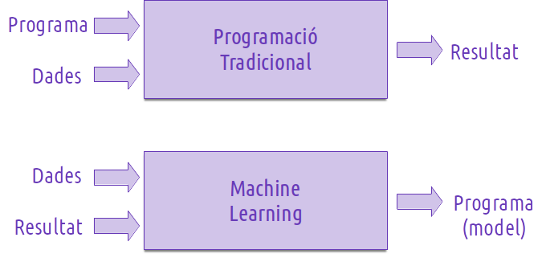
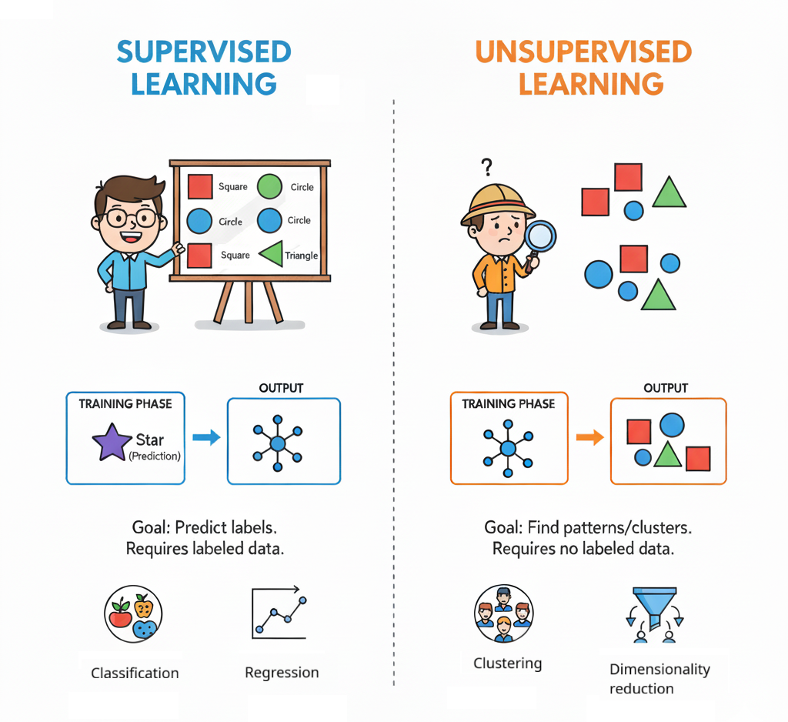
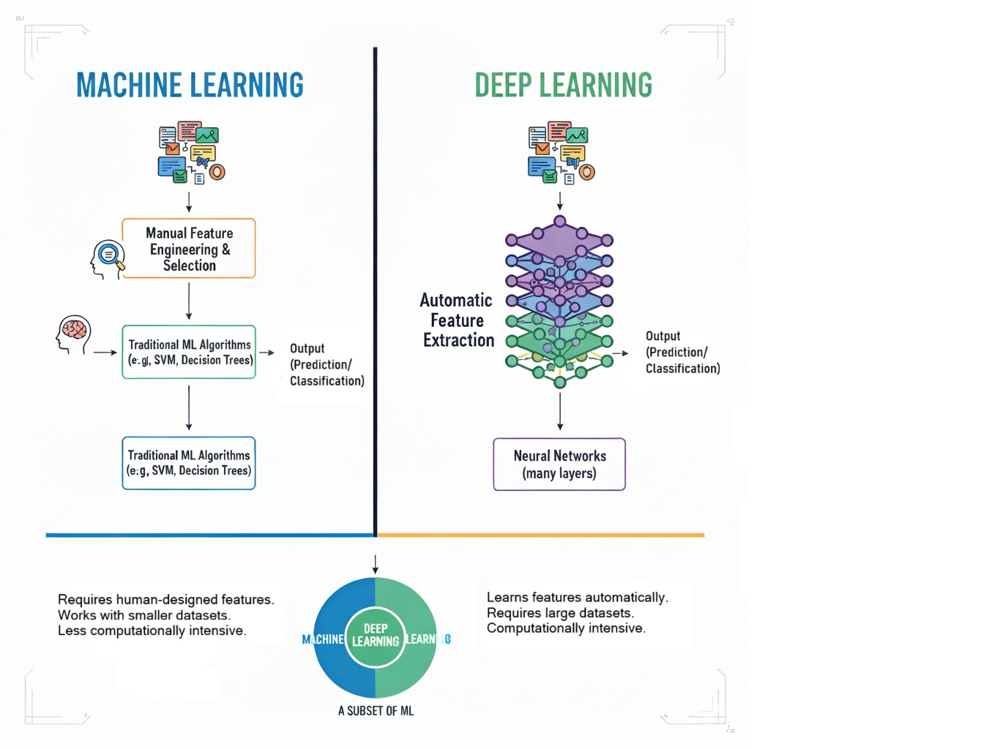

---
# Informació general del document
title: Sistemes d'Aprenentatge Automàtic
subtitle: 
authors: 
    - Departament d'informàtica
lang: ca
page-background: img/bg.png

# Portada
titlepage: true
titlepage-rule-height: 0
# titlepage-rule-color: AA0000
# titlepage-text-color: AA0000
titlepage-background: img/portada.png
# logo: img/logotext.png

# Taula de continguts
toc: true
toc-own-page: true
toc-title: Continguts

# Capçaleres i peus
header-left: Unitat 02 - Sistemes d'Aprenentatge Automàtic
header-right: Curs 2025-2026
footer-left: IES Jaume II El Just
footer-right: \thepage/\pageref{LastPage}

# Imatges
float-placement-figure: H
caption-justification: centering

# Llistats de codi
listings-no-page-break: false
listings-disable-line-numbers: false

header-includes:
     - \usepackage{lastpage}
---
# Sistemes d'Aprenentatge Automàtic

En este mòdul anem a treballar amb una part important de la IA: els **Sistemes d'Aprenentatge Automátic (SAA)**. En primer lloc, i a partir del que hem vist en la introducció, caldrà definir què és un SAA.

## Què és l'Aprenentage automàtic.

L'**aprenentatge automàtic** (AA o també ML de **Machine Learning**) és un subcamp de la intel·ligència artificial que permet als sistemes aprendre i millorar a partir de l'experiència sense ser explícitament programats. Utilitza algoritmes i models matemàtics per analitzar dades, identificar patrons i fer prediccions o decisions basades en aquesta informació.

> Encara que intentarem no anar al fons de les matemàtiques i l'estadística que hi ha darrere dels SAA, és important tindre en compte que són la seua base. Potser caldrà fer un xicotet repàs de conceptes en algun moment i explicar-ne d'altres nous amb un nivel de detall comprensible per a tothom.

Algunes definicions:

- Arthur Samuel (que va treballar per a IBM) el 1959 descrivia l'Aprenentatge Automàtic com ***el camp de l'estudi que dóna als ordinadors la capacitat d'aprendre sense ser programats explícitament***.

- Tom Mitchell (professor a la Universitat de Carnegie Mellon) ha ofert una definició més moderna: ***Es diu que un programa d'ordinador aprèn de l'experiència E pel que fa a alguna classe de tasques T i mesura de rendiment P, si el seu exercici en les tasques en T mesurat per P millora amb l'experiència E***

Per tant, una característica d'un SAA és la capacitat d'aprendre ***de la seua pròpia experiència***. 

Exemple d'escacs (sabeu jugar?):

- Primers programes d'escacs: els donàven les regles del joc, l'objectiu final, el valor de les peces, les jugades permeses i no permeses, un algorisme per valorar una posició... A base de força bruta, trobàven les millors jugades.
- Programes d'escacs actuals: els han donat les regles bàsiques i han aprés, en general, jugant moltes partides contra ells mateix o altres models, aprenent de cada partida i millorant.

També podem recordar el programa de **Deep Mind** que jugava a videojocs de l'Atari 2600 i anava aprenent segons jugava partides i més partides. El sistema estava basat en una **Xarxa Neuronal Profunda** (Deep Neural Network) que es combinava amb una tècnica de **Q-learning**, una forma d'**aprenentatge per reforç**. A mesura que jugava, el sistema rebia recompenses o penalitzacions en funció de les seues accions, i utilitzava esta informació per ajustar els seus paràmetres i millorar en cada nova partida. Així, aprenia a jugar millor sense cap altra orientació humana més que el sistema de recompenses. 

### Exemple concret: detecció de correu brossa

Imagina que volem crear un filtre capaç d'identificar i bloquejar correu brossa (spam). Anem a veure com ho faríem des de la perspectiva clàsica, en un sistema basat en regles o heurístiques, i la diferència respecte a un sistema basat en Machine Learning:

**Perspectiva clàssica**

Els sistemes clàssics de classificació s'han basat en sistemes de regles o heurístiques, consistents en la combinació de condicions per determinar un resultat. Segons aquesta perspectiva, el desenvolupament del filtre implicaría:

- La necessitat d'un analista per fer l'anàlisi del problema i establir un conjunt de regles. Per exemple si apareix o no el nom del destinatari, si conté faltes ortogràfiques, etiquetes html, etc. 
- Avaluació del sistema de regles. Si és vàlid es passaria a producció. Si no ho és, l'analista hauria de tornar a analitzar el problema, detectar les mancances i modificar el conjunt de regles.

Com veiem, es tracta d'un procés que depén fortament de la intervenció humana, i que a més requereix d'una actualització constant del conjunt de regles.

**Perspectiva del Machine Learning**

Segons aquesta perspectiva, com hem dit, el sistema hauria d'aprendre per ell mateix. Ho ha de fer a partir de les dades i resultats proporcionats. Per a això:

- L'analista selecciona una sèrie de correus, identificant les dades rellevants (característiques) per a determinar si és spam o no.
- Les dades se netegen, se validen i se transformen per a preparar-les per a l'entrenament.
- Se selecciona l'algorisme de ML que millor puga contribuir a resoldre el problema.
- Se proporcionen les dades a l'algorisme (entrenament), i aquest va ajustant una sèrie de paràmetres en base a tota eixa informació, la qual cosa li permet crear una sèrie de regles per determinar quan un correu és spam o no. La diferència principal és que **les regles les va creant el propi sistema, no l'analista**.
- S'avalua el model proporcionant noves dades no utilitzades en l'entrenament i valorant els resultats proporcionants pel model. Si són satisfactoris, es passa a producció. Si no ho són, l'analista ha de tornar a analitzar el problema i veure si les dades proporcionades són les adequades o si cal canviar l'algorisme d'entrenament.

Fixeu-vos que si cal canviar alguna cosa en aquest últim cas, no serien les regles perquè de fet no sabem quines són. Si l'algorisme classifica de forma incorrecta una quantitat excesiva de correus, el problema ha d'estar bé en la selecció de les dades per l'entrenament, o en l'algorisme escollit per al model. Eixos serien els aspectes principals per construir un bon sistema de Machine Learning, i per tant els punts que caldria revisar.

Per resumir el que hem parlat en una taula:

| Tipus d'IA                     | També anomenada       | Com funciona                                       | Exemple d’aplicació en escacs |
| ------------------------------ | --------------------- | -------------------------------------------------- | ----------------------------- |
| **IA simbòlica / tradicional** | Programada manualment | Lògica, regles i heurístiques definides per humans | Deep Blue (IBM, 1997)         |
| **IA conexionista / actual**   | Entrenada amb dades   | Aprenentatge a partir d’exemples, autoentrenament  | AlphaZero (DeepMind, 2017)    |

> Acabem d'introduir alguns conceptes nous. No us preocupeu, anirem veient-los al llarg del mòdul.

Pràcticament tota la IA que coneguem en la actualitat està basada en SAA, o en una combinació de la IA tradicional (programada) i la SAA (entrenada).

Podríem dir que la IA tradicional és com un expert que ho sap tot perquè l'hi ho han explicat, mentre que la IA actual (Aprenentatge Automàtic) és com un autodidacta que aprén jugant i experimentant.

Ara, una vegada tenim clar que els sistemes "aprenen", hem de diferenciar entre dos tipus d'aprenentatge.

### Aprenentatge supervisat

La característica fonamental de l'aprenentatge automàtic supervisat és que aquest aprenentatge es realitza a partir de dades que ja **han estat etiquetades prèviament**. L'algorisme aprén a partir d’exemples etiquetats, on cada dada ja té la resposta correcta (la "etiqueta") i el model intenta encertar-la.

És l'exemple clàssic d'entrenament. Per exemple, donar-li moltes fotos de gats i gossos, especificant quines són de gats i quines de gossos, i que el sistema aprenga a diferenciar-los, i després que intente endevinar, d'una quantitat de fotos no etiquetades, quines són gats i quines són gossos. Un altre exemple podría ser classificar correu en spam o normal.

Els problemes d'aprenentatge supervisat es divideixen en dues categories: **Regressió** i **Classificació**.

***Regressió***: Es tracta de predir un valor continu. Per exemple, preveure el preu d'una casa en funció de les seues característiques (mida, ubicació, nombre de dormitoris, etc.).

En general s'utilitzen algorismes de **regressió lineal** per estimar valors reals de variables amb distribució contínua. Busca generar una línia que s'ajuste el millor possible a la distribució de resultats, minimitzant la distància entre els punts i la línia. Encara que és una tècnica estadística, és un bon punt de partida per entendre els algoritmes de ML.

La **regressió logística**, encara que porte la paraula "regressió", és un cas especial que s'utilitza més per a problemes de classificació binària, on es vol predir la probabilitat que una instància corresponga a una classe específica, presència o absència d'una caracerística, etc.

***Classificació***: Es tracta de predir una classe o categoria discreta. Per exemple, classificar correus electrònics com a "spam" o "no spam", si una foto correspon a una o altra categoria, si una radiografia és normal o presenta una patologia, etc.

Entre els algorismes de classificació més comuns estan:

- **Regresió Logística**: com hem comentat abans, és un algorisme de classificació que estima valors discrets (ex., SI/NO) predint la probabilitat d'un esdeveniment o la presència/absència d'una característica determinada. La funció logística es representa amb una corba en forma de S (funció sigmoide).
- **Arbres de decisió**: Construeixen un model de decisions basat en els atributs de les dades, creant bifurcacions fins a arribar a una decisió. Són ràpids, precisos i funcionen bé amb dades numèriques i categòriques. L'algorisme **CART** és el més popular.
- **Random Forest**: És un ensemble d'arbres de decisió que millora la precisió i redueix l'*overfitting* mitjançant la combinació de múltiples arbres. Cada arbre es construeix a partir d'un subconjunt aleatori de les dades i les característiques, i la predicció final es fa mitjançant la votació dels arbres.
- **Màquines de Vectors de Suport (SVM)**: S'apliquen a problemes de classificació, representant cada instància com un punt en un espai n-dimensional i buscant un hiperplà que separe les classes amb el marge més ampli possible. Són de les tècniques més precises en classificació i regressió. L'ús de les màquines de vectors de suport com a classificador s'ha vist incrementat en els últims anys degut a que serveixen per resoldre problemes de classificació i regressió amb alt rendiment i precissió. Són especialment útils en problemes de classificació no lineal, on les dades no es poden separar amb una línia recta.
- **K-Nearest Neighbors (KNN)**: Un mètode supervisat simple i efectiu per a classificació. Classifica un nou cas basant-se en la majoria de les classes dels seus "k" veïns més propers en un mapa de coordenades. És un mètode no paramètric i no "aprèn" en el sentit tradicional, sinó que utilitza tot el conjunt de dades com a base de coneixement. L'elecció del valor de K és crucial.

L'objectiu és que el sistema trobe relacions:

- Similituds
- Diferències
- Tendències

### Aprenentatge no supervisat

En l'aprenentatge no supervisat, l'algorisme no contempla etiquetes prèvies ni respostes correctes. Només rep dades i intenta descobrir patrons o grups per ell mateix. En l'exemple de les fotos, se tractaria de no dir-li quines són gats i quines són gossos, i que se n'adone que hi ha dos grups de fotos que comparteixen característiques molt semblants i diferents a les de l'altre grup.

En l'aprenentatge no supervisat utilitzem algorismes com:

- **Clustering**: Agrupa les dades en clústers o grups basats en la similitud. Un exemple comú és l'algorisme **K-means**, que divideix les dades en K grups basats en la distància entre els punts de dades. L'algorisme **G-means** és una millora sobre **K-means** que busca agrupar les dades en K grups, on K és un paràmetre que l'usuari ha de definir. L'algorisme assigna cada punt de dades al grup més proper i actualitza els centres dels grups iterativament fins a aconseguir una convergència.
- **DBSCAN (Density-Based Spatial Clustering of Applications with Noise)**: és un algorisme de clustering basat en la densitat que agrupa punts que estan densament connectats i marca els punts aïllats com a soroll (outliers). Té alguns avantatges sobre **K-Means**:
  - Detecta clusters de forma arbitrària (no necessàriament esfèrics, com K-Means).
  - No requereix que se especifique la quantitat de clusters prèviament, com en K-Means.
- **Mean Shift**: és un algorisme de clustering basat en la densitat que identifica els clústers com a regions de màxima densitat en l'espai de característiques. L'algorisme busca els punts de màxima densitat en l'espai de característiques, sense suposar res sobre la forma dels clústers. Fa l'estimació del centre de cada clúster mitjançant una finestra de cerca que es mou cap a la direcció de màxima densitat. El procés es repeteix fins que els centres dels clústers convergeixen.

Tot i que en certes fonts s'inclou la **Reducció de dimensionalitat** com a algorisme d'aprenentatge no supervisat, amb tècniques com l'**Anàlisi de Components Principals (PCA)**, en realitat és una forma de reduir la complexitat de les dades mantenint la major part de la informació rellevant. Això és útil per visualitzar dades en espais de menor dimensió o per millorar l'eficiència dels models, simplificant-lo i reduint el temps d'entrenament. Per tant, seria més bé una tècnica de preprocessament de dades que un algorisme d'aprenentatge en si mateix.

### Aprenentatge per reforç

En l'**Aprenentatge per Reforç**, com hem comentat abans al parlar del programa de **Deep Mind**, l'objectiu és aprendre com mapejar situacions o accions per maximitzar una certa recompensa. Es tracta de entrenar agents mitjançant premi i càstig, en funció de si l'acció ha estat beneficiosa o perjudicial, sense necessitat d'especificar com fer la tasca.

Exemples: certs tipus de jocs, robots que aprenen a caminar o robòtica industrial, sistemes de recomanació que aprenen a suggerir contingut basat en les preferències dels usuaris.

## Machine Learning (ML) vS Deep Learning (DL)

El **Machine Learning** (ML) és un subcamp de la intel·ligència artificial que se centra en el desenvolupament d'algorismes i models que permeten a les màquines aprendre a partir de dades. Quan estem parlant de **Sistemes d'Aprenentatge Automàtic** podem dir que estem parlant de ML. Per la seua banda, el **Deep Learning** (DL) és una branca del **Machine Learning** que utilitza **xarxes neuronals** profundes per modelar i resoldre problemes complexos. Ja veurem més endavant que les xarxes neuronals són una de les tècniques més potents i utilitzades en l'aprenentatge automàtic.

### Diferències clau

- **Estructura del model**: ML pot utilitzar models més simples com arbres de decisió o regressió logística, mentre que DL utilitza xarxes neuronals amb múltiples capes (profundes).
- **Requeriments de dades**: DL generalment necessita grans quantitats de dades etiquetades per entrenar models efectius, mentre que ML pot funcionar amb conjunts de dades més petits.
- **Potència computacional**: DL requereix més potència computacional i recursos d'GPU per entrenar models, mentre que ML pot ser més eficient en termes de recursos.

> El fet que el Deep Learning necessite de gran quantitats de dades és el motiu pel qual també tenim els mòduls de **Sistemes de Big Data** i **Big Data Aplicat**. La possibilitat de treballar amb grans volums de dades, oferida per els sistemes de Big Data desenvolupats en les últimes dècades, ha estat un factor clau en l'èxit actual del Deep Learning i la IA en general.

### Algunes tècniques de Deep Learning.

Algunes tècniques i arquitectures comunes en el Deep Learning, que també anirem estudiant al llarg del mòdul, inclouen:

- **Xarxes Neuronals Simples**: la base del Deep Learning, consistixen en capes de neurones connectades entre si, on cada capa processa les dades i les transmet a la següent. Un exemple serien els **perceptrons**, que són xarxes neuronals amb una sola capa oculta.
- **Xarxes Neuronals Profundes (DNN)**: xarxes neuronals amb múltiples capes ocultes que permeten modelar relacions complexes en les dades.
- **Xarxes Neuronals Convolucionals (CNN)**: utilitzades principalment en el processament d'imatges, utilitzen operacions de convolució per detectar característiques espacials i patrons en les dades.
- **Xarxes Neuronals Recurrentes (RNN)**: dissenyades per a dades seqüencials, com el text o les sèries temporals, utilitzen connexions recurrents per capturar dependències temporals.
- **Xarxes Generatives Antagonistes (GAN)**: utilitzades per generar dades noves, com imatges o música, mitjançant dos models que competeixen entre si: un generador i un discriminador.
- **Transformers**: arquitectures que utilitzen mecanismes d'atenció per processar dades seqüencials, com el text, permetent una millor comprensió del context i les relacions entre les paraules.
- **Transfer learning**: tècnica que permet utilitzar models prèviament entrenats en tasques similars per millorar l'aprenentatge en una nova tasca, reduint el temps d'entrenament i millorant la precisió.
- **Fine tunning**: ajustament de models preentrenats per adaptar-los a una tasca específica, millorant la precisió i reduint el temps d'entrenament.

> Tot i ser tècniques de Deep Learning i, en alguns casos, utilitzar xarxes neuronals, les **GAN** i els **Transformers** els veurem en el mòdul de **Models d'IA**. Les GAN perquè són models generatius que no s'adapten exactament als algorismes que veurem en **SAA**, i els Transformers perquè són models que s'utilitzen principalment en el processament del llenguatge natural, un apartat del mòdul de **MIA**.

## Machine Learning i estadística

Hi ha una connexió profunda entre l'Estadística i l'Aprenentatge Automàtic (Machine Learning). Segons **Larry A. Wasserman**, professor de la Carnegie Mellon, quan li van preguntar per les diferències, va respondre: "*La resposta curta és: cap. S'ocupen… de la mateixa pregunta: com aprenem a partir de les dades?*"

Tot això, caldria especificar que:

- **Estadística tradicional**: se centra en la inferència estadística formal (intervals de confiança, proves d'hipòtesis, estimadors òptims) en problemes de baixa dimensió (conjunts de dades menuts).
- **Aprenentatge Automàtic**: es focalitza més en fer prediccions precises en altes dimensions (grans conjunts de dades).

Ambdues disciplines busquen extraure coneixement de les dades i empren tècniques similars. De fet, en la majoria d'ocasions cada pas en un projecte d'Aprenentatge Automàtic requereix l'ús d’un mètode estadístic, des de la comprensió de les dades fins a la interpretació dels resultats.

Més endavant repassarem alguns conceptes bàsics d'estadística que són fonamentals per entendre els SAA.

## Components i fases de l'Aprenentatge Automàtic

Hem de recordar que l'Aprenentatge Automàtic (ML) dins del terreny de la intel·ligència artificial se centra a desenvolupar sistemes capaços d'aprendre automàticament a partir de dades, amb l’objectiu de fer prediccions o prendre decisions sense programació explícita per a cada cas. Per tant, el procés necessita estar ben estructurat. Podem defiir per una banda els components principals que necessitaria un **SAA**, i per altra banda les fases que caldria seguir per a desenvolupar-lo.

### Components principals d'un SAA

Per entendre com funciona, podem identificar diversos components fonamentals. Per aclarir què passa en cada fase, agafem com a exemple un sistema que aprén a detectar si un correu electrònic és correu brossa (spam):

- **Entrada (x):** Les dades d’entrada, també anomenades característiques (features), són les propietats mesurables d’una instància.

→ Exemple: nombre de vegades que apareix la paraula "gratis" en un correu.

- **Eixida (y):** És el resultat que volem predir o classificar.

→ Exemple: "spam" o "no spam".

- **Funció objectiu (f: X → Y):** És la funció ideal que mapeja cada entrada a la seua eixida correcta. Aquesta funció és desconeguda en la realitat (si la coneguérem, podríem crear una solució programada, un ***Model***), però és la que volem aproximar.

- **Dades:** Són els registres històrics d'exemples d’entrada i eixida coneguts.

→ Exemple: una gran quantitat de correus etiquetats com spam o no spam.

- **Hipòtesi (g: X → Y):** És la funció aproximada que el model aprén a partir de les dades. Intenta assemblar-se al màxim a la funció objectiu.

El model que obtenim és, de fet, la representació matemàtica de la hipòtesi que el sistema ha après a partir de l'experiència (les dades).

### Fases del procés d'Aprenentatge Automàtic

Tot el procés d'aprenentatge automàtic es pot dividir en diverses fases, que poden variar lleugerament depenent del projecte, però que generalment inclouen:

1. **Definició del problema:** Comprendre i definir clarament el problema (empresarial, científic, etc.) que es vol resoldre.

2. **Recollida de dades:** Obtenir les dades necessàries per entrenar el model.

3. **Preprocessament de dades:** Netejar i preparar les dades per a l'anàlisi. La recollida i preparació de dades ocupa moltes vegades la major part del temps d'un projecte d'aprenentatge automàtic.

   - **Neteja de dades:** Eliminar valors nuls, duplicats o erronis.
   - **Extracció de dades de qualitat:** Seleccionar les dades rellevants per al problema.
   - **Transformació de dades:** Convertir les dades a un format adequat per al model (normalització, codificació de variables categòriques, etc.).

4. **Selecció de característiques:** Escollir les característiques més rellevants per al model.

5. **Entrenament del model:** Utilitzar les dades d'entrenament per ajustar els paràmetres del model. Normalment no utilitzarem totes les dades disponibles per l'entrenament, sinó que les dividirem en un conjunt d'entrenament i un de validació. Així, el model pot aprendre de les dades d'entrenament i després ser avaluat i validat (en el seu cas) amb les dades de validació.

6. **Avaluació del model:** Provar el model amb dades noves per avaluar-ne el rendiment. En general utilitzarem el 80% de les dades per a l'entrenament i el 20% restant per a la validació. Així, podem comprovar si el model ha après correctament i si és capaç de generalitzar a dades noves. Es comparen les prediccions del model amb les etiquetes o resultats reals per calcular mètriques de rendiment com l'exactitud, la precisió, el *recall*, etc.

7. **Ajust d'hiperparàmetres:** Optimitzar els paràmetres del model per millorar el seu rendiment. Això pot incloure ajustar la complexitat del model, la taxa d'aprenentatge, el nombre d'iteracions, la profunditat d'un arbre de decisió, etc.

   - **Validació creuada:** Una tècnica per avaluar el rendiment del model en diferents subconjunts de dades.
   - **Grid search o Random search:** Tècniques per trobar la millor combinació d'hiperparàmetres.

8. **Desplegament:** Implementar el model en un entorn de producció.

9. **Monitorització i manteniment:** Supervisar el model en funcionament i actualitzar-lo segons siga necessari.

## Errors freqüents en l'Aprenentatge Automàtic

Tot i que els algoritmes d'aprenentatge automàtic poden ser molt potents, aplicar-los sense criteri pot ser contraproduent. Alguns errors comuns que es poden cometre en el procés d'aprenentatge automàtic són:

- Respondre la pregunta incorrecta
- Recollir o utilitzar dades inadequades.
- Seleccionar malament l'algoritme per al problema.
- No entendre els biaixos o limitacions del model.
- No validar i optimitzar adequadament el model.
- Interpretar malament els resultats.

### Quan utilitzar (o no) l'Aprenentatge Automàtic

L'aprenentatge automàtic serà apropiat principalment en estos casos:

- problemes que comporten conjunts de dades grans i complexos, on és difícil relacionar les diferents característiques i establir un conjunt de regles heurístiques. Un exemple d'aquest tipus seria el filtre d'Spam que hem vist.
- problemes que comporten no només conjunts grans de dades, sinò de moltes característiques a analitzar (el que es coneix com **alta dimensionalitat**), de manera que no és senzill establir relacions entre elles. Un possible exemple seria l'anàlisi d’informació genètica en biologia molecular.
- problemes complexos, amb patrons no linials, on l'analista no sap determinar a simple vista una solució a partir de la informació existent. Alguns exemples poden ser la classificació d'imatges, el reconeixement de dígits manuscrits o de veu.
- entorns que fluctúen amb freqüència, que són canviants amb el temps i per tant requereixen una adaptació constant. Un exemple pot ser la predicció del trànsit de vehicles en temps real o el tràfic de xarxa.

## IA Generativa

L'**IA Generativa** és un subcamp de la intel·ligència artificial que se centra en la creació de contingut nou i original, com ara imatges, text, música o vídeos, mitjançant l'ús d'algorismes d'aprenentatge automàtic. A diferència de la IA tradicional, que es basa en la classificació o predicció de dades existents, l'IA generativa busca produir noves dades que segueixin les mateixes característiques o patrons que les dades d'entrenament.

Abans hem parlat els algorismes de **Generative Adversarial Networks (GAN)** i els **Transformers**. Serien algorismes que s'utilitzen com a tècniques d'IA generativa. Aquestes tècniques han revolucionat el camp de la IA, permetent la creació de contingut de gran qualitat i realisme.

## Eines i llenguatges de programació per a l'Aprenentatge Automàtic

Encara que se poden utilitzar molts llenguatges de programació per a l'aprenentatge automàtic, el més habitual és **Python**. Ho és bàsicament perquè ofereix una gran quantitat de biblioteques i eines que faciliten el desenvolupament de models d'aprenentatge automàtic, com ara:

- **NumPy**: per al càlcul numèric, informàtica científica i operacions amb arrays N-dimensionals.
- **Matplotlib**: per a la visualització de dades.
- **Seaborn**: per a la visualització estadística de dades.
- **Pandas**: per a la manipulació i anàlisi de dades (DataFrames).
- **Scikit-learn**: per a l'aprenentatge automàtic tradicional, tant supervisat com no supervisat (preprocessament, classificació, regressió, clustering, avaluació, etc.).
- **TensorFlow** i **PyTorch**: per a l'aprenentatge profund (deep learning) i la creació de xarxes neuronals.
- **Keras**: una API de Python per a la creació de models d'aprenentatge profund, que pot utilitzar TensorFlow o Theano com a backend. Redueix la quantitat de codi necessari per crear models d'aprenentatge profund i facilita la construcció i entrenament de xarxes neuronals.

Els entorns de desenvolupament més comuns inclouen **Jupyter Notebooks**, **Google Colab** i **VSCode/PyCharm** amb entorns de tipus **Conda**.

> **Conda** és un gestor d'entorns i paquets que permet crear entorns aïllats per a projectes de Python, facilitant la gestió de dependències i versions de biblioteques. Així evitem problemes de compatibilitat entre projectes i podem tenir diferents versions de les mateixes biblioteques en diferents entorns.

