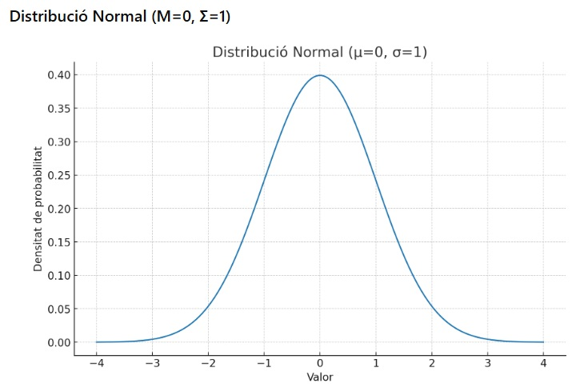
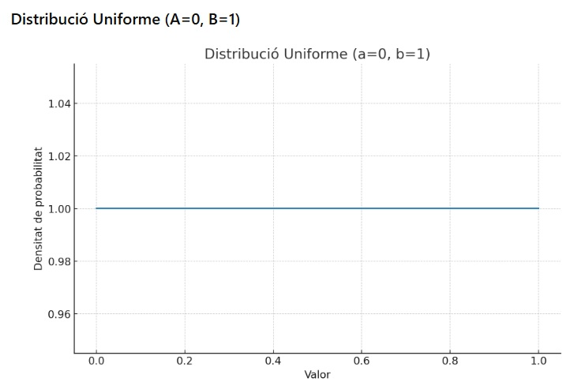
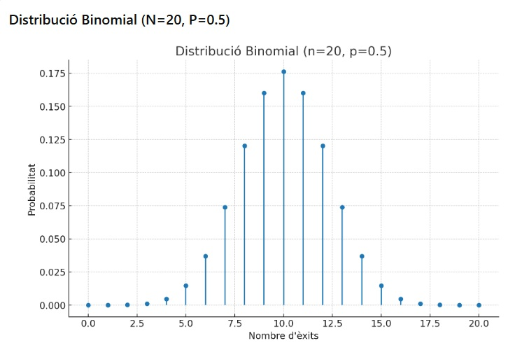
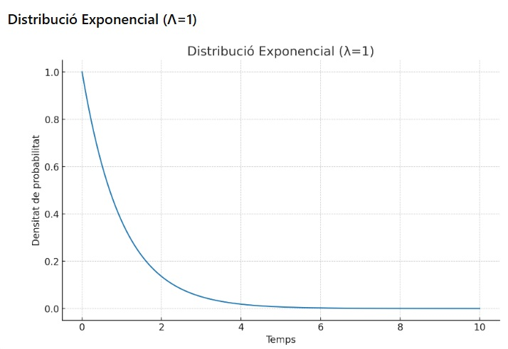
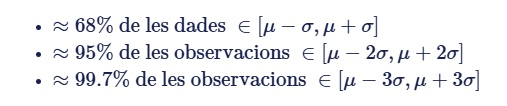
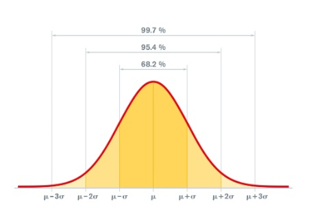
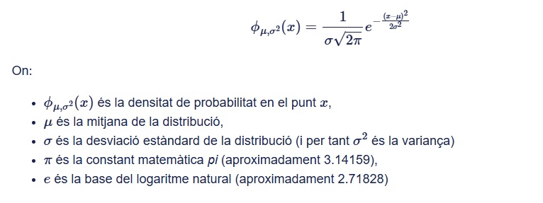

---
# Informació general del document
title: Preprocessament i estadística
subtitle: Sistemes d'aprenentatge automàtic
authors: 
    - Departament d'informàtica
lang: ca
page-background: img/bg.png

# Portada
titlepage: true
titlepage-rule-height: 0
# titlepage-rule-color: AA0000
# titlepage-text-color: AA0000
titlepage-background: img/portada.png
# logo: img/logotext.png

# Taula de continguts
toc: true
toc-own-page: true
toc-title: Continguts

# Capçaleres i peus
header-left: Unitat 03 - Preprocessament i estadística
header-right: Curs 2025-2026
footer-left: IES Jaume II El Just
footer-right: \thepage/\pageref{LastPage}

# Imatges
float-placement-figure: H
caption-justification: centering

# Llistats de codi
listings-no-page-break: false
listings-disable-line-numbers: false

header-includes:
     - \usepackage{lastpage}
---

# Preprocessament de les dades. Estadística.

En la unitat anterior hem vist els conceptes bàsics de la intel·ligència artificial i els sistemes d'aprenentatge automàtic. Hem comentat les diferents fases per les quals passa un projecte d'aprenentatge automàtic. Ara ens centrarem en el **preprocessament de les dades**, un pas fonamental en el desenvolupament dels models.

## Què és el preprocessament de les dades?

El preprocessament de les dades és el conjunt d'operacions que es realitzen sobre les dades brutes per preparar-les per a l'anàlisi i l'entrenament dels models d'aprenentatge automàtic. Aquest pas és crucial perquè la qualitat de les dades influeix directament en el rendiment del model. Si treballem directament sobre les dades brutes tenim el risc de crear models poc precisos o fins i tot erronis. Els motius principals per realitzar el preprocessament de les dades són:

- **Eliminar el soroll**: Les dades brutes sovint contenen informació irrellevant o sorollosa que pot distorsionar els resultats del model.
- **Millorar la qualitat de les dades**: Les dades brutes poden incloure valors nuls, duplicats o fins i tot erronis que poden afectar negativament els resultats del model.
- **Facilitar l'anàlisi**: Les dades preprocessades són més fàcils d'analitzar i interpretar, ja que estan en un format més net i estructurat.
- **Optimitzar el rendiment del model**: Un bon preprocessament pot reduir el temps d'entrenament i millorar la precisió del model, ja que les dades estan preparades de manera adequada per a l'aprenentatge automàtic.
- **Adaptar les dades al model**: Alguns models requereixen que les dades estiguin en un format específic, com ara valors normalitzats o codificats. El preprocessament ajuda a adaptar les dades a aquests requisits.  

## Etapes del preprocessament de les dades

El primer pas, lògicament, seria **recollir** les dades. Hem de trobar una font de dades fiable i rellevant per al nostre projecte, o bé generar-les a través d'observacions o simulacions. Un cop tenim les dades, és quan comença realment el preprocessament.

El preprocessament de les dades pot incloure diverses etapes, depenent del tipus de dades i del problema a resoldre. Algunes de les etapes més comunes són:

- **Exploració de dades**: Anàlisi inicial per comprendre la distribució, les tendències i les anomalies de les dades.
- **Neteja de dades**: Eliminació de valors nuls, duplicats o erronis.
- **Transformació de dades**: Escalatge, normalització o codificació de les dades.
- **Selecció de característiques**: Tria de les variables més rellevants per al model (i eliminació de les irrellevants).
- **Divisió de dades**: Separació de les dades en conjunts d'entrenament i prova.

El preprocessament de les dades és essencial per garantir que els models d'aprenentatge automàtic funcionen de manera òptima. Un bon preprocessament pot millorar la precisió del model, reduir el temps d'entrenament i evitar problemes com l'*overfitting*. A més, ajuda a identificar i corregir errors en les dades abans que afecten el rendiment del model.

> L'*overfitting* és un problema comú en l'aprenentatge automàtic on el model s'ajusta massa als detalls i al soroll de les dades d'entrenament, perdent la capacitat de generalitzar a noves dades. Per posar un exemple concret, si entrenem un model per reconèixer gats i gossos amb imatges que només contenen animals d'un color específic, el model pot aprendre a identificar només aquells colors i no generalitzar bé a altres colors d'animals.

En resum, determinats aspectes seran clau en el tractament de les dades:

- registres incomplets (*missing values*)
- registres amb valors anòmals (*outliers*) que poden influir en l'anàlisi
- estandarització de les dades, per a que tots estiguen en una mateixa escala
- reducció de la dimensionalitat o selecció de variables significatives per al problema a resoldre si el conjunt de dades és molt gran o divers

## Repàs estadística

Per a poder realitzar un bon preprocessament de les dades, és important tenir coneixements bàsics d'estadística. Això ens permetrà entendre millor les característiques de les dades i aplicar les tècniques adequades per al seu tractament. Sobretot anem a necessitar eines d'**estadística descriptiva**. L'estadística descriptiva és una branca de les matemàtiques que s'encarrega principalment de descriure un conjunt de dades, per tal de facilitar-ne la seua comprensió.

Dins l'estadística descriptiva distingim dos tipus de mesures, les de **tendència central** o centralitat i les de variabilitat o **dispersió**. Les mesures de **tendència central** són aquelles que busquen identificar un valor representatiu dins del conjunt de dades, o veure com s'agrupen les dades al voltant d'un punt central. Les mesures de **dispersió** indiquen com de disperses o agrupades estan les dades al voltant de les mesures de tendència central. 

>Per exemple, imagineu que les notes d'una classe són 1, 1, 2, 2, 3, 5, 5, 9, 9, 9, 10.
>
>La mitjana seria 5,09, o siga pràcticament 5
>La mediana seria 5, o siga el valor que separa la meitat superior de la meitat inferior
>La moda seria 9, o siga el valor que apareix amb més freqüència
>
>Però de totes estes mesures, no hi ha cap que ens diga que hi ha quatre notes excel·lents i la resta tenen un 5 o han suspés. Això ens ho han de dir les mesures de dispersió. La mitjana i la mediana també serien 5 si tot l'alumnat tinguera un 5, i la situació seria diferent i necessitaria una altra anàlisi.

Anem a repassar les mesures més comunes d'estadística descriptiva:

***de tendència central***

- **Mitjana**: La suma de tots els valors dividida pel nombre de valors.
- **Mediana**: El valor que separa la meitat superior de la meitat inferior d'un conjunt de dades. És útil per identificar la tendència central en dades amb *outliers*. En eixe cas, seria una mesura de tendència central de vegades més robusta que la mitjana.
- **Moda**: El valor que apareix amb més freqüència en un conjunt de dades. Pot haver-hi més d'una moda en un conjunt de dades. És especialment útil en dades més qualitatives o categòriques.

***de dispersió***

- **Rang**: La diferència entre el valor màxim i el mínim d'un conjunt de dades. Indica l'amplitud de la variació.
- **Desviació estàndard**: Mesura de la dispersió dels valors respecte a la mitjana. Una desviació estàndard alta indica que els valors estan molt dispersos.
- **Variança**: Mesura de la dispersió dels valors respecte a la mitjana. És el quadrat de la desviació estàndard i indica com de dispersos estan els valors al voltant de la mitjana.
- **Quartils** i **Rang interquartilic**: Divisió dels valors en quatre parts iguals. El primer quartil (Q1) és el valor que separa el 25% inferior del conjunt de dades, el segon quartil (Q2) és la mediana i el tercer quartil (Q3) és el valor que separa el 75% inferior del conjunt de dades. Els **quartils** avaluen la dispersió i simetria de les dades. El **rang interquartilic** (IQR) és la diferència entre el tercer quartil i el primer quartil, i mesura la dispersió dels valors centrals del conjunt de dades eliminant els valors molt alts (quart quartil) i molt baixos (primer quartil).

Hi ha una altra mesura que és important per a l'anàlisi de dades, encara que no pertany a les mesures de tendència central o dispersió, que és la **correlació**. La correlació ens troba la relació entre dues variables. Eixa relació pot ser ***positiva*** (ambdues variables augmenten juntes), ***negativa*** (quan una augmenta l'altra disminueix) o ***nul·la*** (no hi hap relació entre les variables). És útil quan volem saber si dues variables estan relacionades i, si és així, com ho estan.

### Mesures d'estadística en Python

Python ofereix diverses biblioteques per al càlcul d'estadístiques descriptives, com ara **NumPy**, **Pandas** i **SciPy**. Aquestes biblioteques proporcionen funcions per calcular les mesures de tendència central i dispersió de manera eficient. En el mòdul de **Programació** veureu com utilitzar-les. Ací simplement oferim uns quants exemples bàsics:

```python
import numpy as np # Biblioteca per al càlcul numèric
import pandas as pd # Biblioteca per al treball amb dades estructurades
# Creem un conjunt de dades d'exemple, per exemple el que hem vist abans de les notes       
data = [1, 1, 2, 2, 3, 5, 5, 9, 9, 9, 10]
# Convertim la llista a un array de NumPy
data_array = np.array(data)
# Calculem la mitjana
mean = np.mean(data_array)
# Calculem la mediana
median = np.median(data_array)
# Calculem la moda
mode = pd.Series(data).mode()[0]  # Utilitzem Pandas per calcular la moda, perquè NumPy no té una funció directa
# Calculem la desviació estàndard
std_dev = np.std(data_array)
# Calculem la variança
variance = np.var(data_array)
# Calculem el rang
data_range = np.max(data_array) - np.min(data_array)
# Calculem els quartils
q1 = np.percentile(data_array, 25)  # Primer quartil
q2 = np.percentile(data_array, 50)  # Mediana
q3 = np.percentile(data_array, 75)  # Tercer quartil
# Calculem el rang interquartilic
iqr = q3 - q1

# No hem calculat la correlació perquè només tenim una variable que és la nota.

# Mostrem els resultats
# Recordem les dades de l'exemple
print("Dades:", data)
print("Mesures d'estadística descriptiva:")
print(f"Mitjana: {mean}")
print(f"Mediana: {median}")
print(f"Moda: {mode}")
print(f"Desviació estàndard: {std_dev}")
print(f"Variança: {variance}")
print(f"Rang: {data_range}")
print(f"Quartil 1: {q1}")
print(f"Quartil 2: {q2}")
print(f"Quartil 3: {q3}")
print(f"Rang interquartilic: {iqr}")

```

Veiem la sortida esperada del codi anterior:

```
Dades: [1, 1, 2, 2, 3, 5, 5, 9, 9, 9, 10]
Mesures d'estadística descriptiva:
Mitjana: 5.090909090909091
Mediana: 5.0
Moda: 9
Desviació estàndard: 2.516611478423583
Variança: 6.3478260869565215
Rang: 9
Quartil 1: 2.0
Quartil 2: 5.0
Quartil 3: 9.0
Rang interquartilic: 7.0
```

### Interpetació de les mesures

Ara que tenim les mesures d'estadística descriptiva, podem interpretar els resultats:

- **Mitjana**: La mitjana és 5,09, que indica que la nota mitjana de la classe és aproximadament un 5. Molt justet, però aprovat.
- **Mediana**: La mediana és 5, el que donaria a entendre (si no tenim més informació) que la meitat de l'alumnat ha aprovat i l'altra meitat ha suspés.
- **Moda**: La moda és 9, el que indica que la nota més freqüent és un 9, i per tant hi ha un grup d'alumnes que ha obtingut una nota alta.
- **Desviació estàndard**: La desviació estàndard és 2,52, el que indica que les notes estan moderadament disperses al voltant de la mitjana. Això vol dir que hi ha una variabilitat significativa en les notes dels alumnes, encara que no és exagerada
- **Variança**: La variança és 6,35, que és una mesura de la dispersió dels valors respecte a la mitjana. Una variança més alta indica una major variabilitat en les notes. En aquest cas el valor és moderat, la qual cosa confirma que hi ha una variabilitat significativa però no extrema.
- **Rang**: El rang és 9, que és la diferència entre la nota més alta (10) i la més baixa (1). Això indica que hi ha una gran diferència de rendiment en les notes dels alumnes.
- **Quartils**: El primer quartil (Q1) és 2, el segon quartil (Q2) és 5 i el tercer quartil (Q3) és 9. Això indica que el 25% dels alumnes tenen notes iguals o inferiors a 2, el 50% tenen notes iguals o inferiors a 5 i el 75% tenen notes iguals o inferiors a 9.
- **Rang interquartilic (IQR)**: L'IQR és 7, que es calcula com la diferència entre el tercer quartil (Q3) i el primer quartil (Q1). Això indica que hi ha una variabilitat significativa en les notes dels alumnes, ja que la majoria de les notes es troben dins d'aquest rang.

En resum, juntant totes les variables sí que hi ha una dispersió important en les notes. El grup està molt polaritzat i caldria prendre mesures per a millorar el rendiment dels alumnes que tenen notes més baixes, i segurament també per a reforçar el rendiment dels alumnes que tenen notes més altes, per a que no es relaxin i continuen millorant.

## Distribució de les dades

La distribució de les dades és una altra característica important a l'hora de realitzar el preprocessament. La distribució ens indica com es distribueixen els valors d'una variable en un conjunt de dades. Hi ha diverses distribucions comunes, com ara la **normal**, la **uniforme**, la **binomial** o l'**exponencial**, entre altres.

La **distribució normal** o **distribució Gaussiana** és una de les més importants en estadística i s'utilitza sovint com a model per a moltes variables naturals. Té una forma de campana més o menys simétrica al voltant de la mitjana (la majoria dels valors es troben a prop de la mitjana, i la probabilitat disminueix a mesura que ens allunyem d'ella).



La **distribució uniforme** és una distribució on tots els valors tenen la mateixa probabilitat d'aparèixer. És útil quan volem modelar situacions on no hi ha preferència per cap valor en particular. Per exemple, llançar un dau on tots els valors (1-6) tenen la mateixa probabilitat d'aparèixer.



La **distribució binomial** és una distribució discreta que modela el nombre d'èxits en un nombre fix de proves independents, on cada prova té dues possibles resultats (èxit o fracàs). És útil per a situacions com ara el nombre d'encerts en un test de preguntes de resposta múltiple. En general té una forma asimètrica, depenent de la probabilitat d'èxit (p). Si p és 0.5, la distribució és simètrica i per tant s'assembla a una distribució normal.



La **distribució exponencial** és una distribució contínua que modela el temps entre esdeveniments en un procés. En general té una cúa llarga en un extrem i decau ràpidament en l'altre extrem. És útil per a situacions com ara el temps entre trucades en un call center o el temps entre arribades de clients a una botiga.




| **Distribució** | **Tipus**  | **Paràmetres**                                      | **Forma**                        | **Exemple**                                                  |
|-----------------|------------|-----------------------------------------------------|----------------------------------|--------------------------------------------------------------|
| Binomial        | Discreta   | n (nombre de proves), p (prob. d'èxit)             | Asimètrica (depèn de p)          | Nombre d'encerts en un test de 10 preguntes amb p = 0.5      |
| Exponencial     | Contínua   | λ (lambda, taxa d'esdeveniments)                   | Asimètrica (positiva)            | Temps entre trucades en un call center                       |
| Normal          | Contínua   | μ (mitjana), σ (desviació típica)                  | Simètrica, forma de campana      | Alçades de persones en una població                          |
| Uniforme        | Contínua   | a (mínim), b (màxim)                               | Plana (prob. constant)           | Valor aleatori entre 0 i 1 (per sortejos)                    |

Conéixer com es distribueixen les dades és de gran importància per tal de crear uns o altres models. Per exemple, si les dades segueixen una distribució normal podem utilitzar tècniques estadístiques que assumeixen aquesta normalitat. Si les dades no segueixen una distribució normal, haurem d'optar entre fer algun tipus de transformació o utilitzar altres models que no necessiten una distribució normal. Ja veurem quines transformacions podem aplicar en cada cas.

### Distribucions en Python

Python també ofereix diverses biblioteques per treballar amb distribucions de dades, com ara **NumPy**, **SciPy** i **Matplotlib**. Aquestes biblioteques proporcionen classes i mètodes per generar dades aleatòries segons diferents distribucions i per visualitzar-les. 

A continuació, un exemple de com generar dades aleatòries segons diferents distribucions i visualitzar-les:

```python
import numpy as np
import matplotlib.pyplot as plt
# Configuració de la figura
plt.figure(figsize=(12, 8))
# Generem dades aleatòries per a cada distribució
# Distribució normal
normal_data = np.random.normal(loc=0, scale=1, size=1000)  # loc és la mitjana, scale és la desviació estàndard, size és el nombre de dades
# Distribució uniforme
uniform_data = np.random.uniform(low=0, high=1, size=1000)  # low és el mínim, high és el màxim
# Distribució binomial
binomial_data = np.random.binomial(n=10, p=0.5, size=1000)  # n és el nombre de proves, p és la probabilitat d'èxit
# Distribució exponencial
exponential_data = np.random.exponential(scale=1, size=1000)  # scale és l'invers de la taxa d'esdeveniments. Un valor 1 vol dir que esperem una taxa d'esdevinents de 1 per unitat de temps. Un valor 5 vol dir que esperem una taxa d'esdeveniments de 0.2 (1/5) per unitat de temps.
# Creem un subplot per a cada distribució
plt.subplot(2, 2, 1)
plt.hist(normal_data, bins=30, density=True, alpha=0.5, color='b')
plt.title('Distribució Normal')
plt.xlabel('Valor')
plt.ylabel('Densitat')
plt.subplot(2, 2, 2)
plt.hist(uniform_data, bins=30, density=True, alpha=0.5, color='g')
plt.title('Distribució Uniforme')
plt.xlabel('Valor')
plt.ylabel('Densitat')
plt.subplot(2, 2, 3)
plt.hist(binomial_data, bins=30, density=True, alpha=0.5, color='r')
plt.title('Distribució Binomial')
plt.xlabel('Valor')
plt.ylabel('Densitat')
plt.subplot(2, 2, 4)
plt.hist(exponential_data, bins=30, density=True, alpha=0.5, color='y')
plt.title('Distribució Exponencial')
plt.xlabel('Valor')
plt.ylabel('Densitat')
# Mostrem la figura
plt.tight_layout()
plt.show()  
```

Executeu el codi anterior en un quadern Jupyter o en un entorn Python per veure les gràfiques de les diferents distribucions. Cada gràfica mostra la distribució de les dades generades aleatòriament segons el tipus de distribució especificat. Compareu els resultats amb les gràfiques d'exemple que hem vist abans en la unitat.

## Regla empírica de la distribució normal

La regla empírica, també coneguda com a regla **68-95-99.7**, és una guia empírica que descriu com es distribueixen les observacions en una distribució normal. Aquesta regla és útil per a entendre la dispersió de les dades en una distribució normal i proporciona estimacions aproximades de la proporció de dades dins de determinats intervals al voltant de la mitjana.

La regla empírica estableix el següent:



És a dir, que en una distribució normal aproximadament el 68% de les observacions es troben dins d'una desviació típica de la mitjana, el 95% de les observacions dins de dues desviacions típiques de la mitjana, i el 99.7%  dins de tres desviacions típiques de la mitjana.



## Conceptes matemàtics de la distribució normal

Per a poder treballar amb distribucions normals, hem d'entendre alguns conceptes matemàtics i nomenclatura relacionada amb aquesta distribució.

**Població i mostra poblacional**

En estadística, quan parlem de **població** ens refereim a tot el conjunt d'individus o elements d'observació que s'estudien en un context particular. Segons aquest context, la població pot ser finita o infinita (tan gran que es desconeix el nombre exacte, com per exemple tota la població del planeta).

Quan volem fer un estudi sobre una població concreta, sobretot si és molt gran i no podem estudiar individu per individu, el que es fa és agafar una mostra representativa de la població, la qual anomenem **mostra poblacional**.

Si la mostra poblacional és suficientment representativa de la població, ens permetrà realitzar **inferències** sobre la població completa. És a dir, que les conclussions que obtinguem sobre la mostra poblacional seran aplicables també a tota la població.

**Variables aleatòries i distribucions de probabilitat**

Una **variable aleatòria** es defineix com una funció que assigna valors numèrics als resultats d'un experiment o als elements d'una població, transformant el resultat de les observacions en quantitats. Aquestes variables aleatòries són utilitzades per descriure i quantificar la variabilitat o la incertesa en els resultats d'un experiment o en les característiques d'una població, i poden ser discretes (com els resultats de llançar un dau) o contínues (com una medició de la temperatura).

> Formalment, diguem que una variable aleatòria es una funció definida sobre un espai de probabilitat. Al final, és una eina matemàtica que ens permet treballar amb els resultats d'un estudi o una població en termes numèrics.

Una **distribució de probabilitat** és una funció matemàtica que descriu la probabilitat de cada possible valor d'una variable aleatòria. Aquesta distribució pot ser discreta (per a variables aleatòries discretes) o contínua (per a variables aleatòries contínues). La distribució de probabilitat indica com estan distribuides les probabilitats entre els diferents valors possibles de la variable i permet calcular la probabilitat que la variable aleatòria prenga valors en determinats intervals.

La funció de densitat de probabilitat proporciona una representació matemàtica de la variabilitat i la incertesa associades a aquesta variable aleatòria en una població o mostra poblacional, i pren generalment la forma d’una campana de Gauss.

L’expressió matemàtica que descriu aquesta funció de densitat de probabilitat és:

