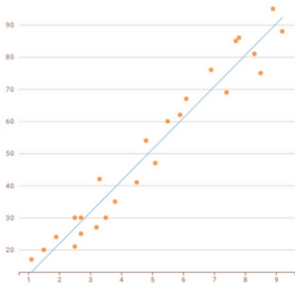
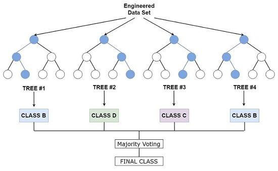

# Aprenentatge supervisat

En l'aprenentatge supervisat, el model s'entrena amb un conjunt de dades etiquetades, és a dir, dades que ja contenen la resposta correcta. L'objectiu és que el model aprenga a fer prediccions o classificacions basades en aquestes dades. Les dades d'entrada s'anomenen **features** o **atributs**, mentre que les dades correctes de sortida s'anomenen **etiquetes** o **targets**.

En este cas és quan dividim el dataset en un conjunt d'entrenament i un conjunt de prova. El conjunt d'entrenament s'utilitza per ajustar el model (li subministrem les dades amb els seus atributs i també les eixides o etiquetes correctes), mentre que el conjunt de prova (només amb els atributs) s'utilitza per avaluar-ne el rendiment del model entrenat.

Un exemple on podríem utilitzar algorismes d'aprenentatge supervisat podria ser la classificació de correus electrònics com a spam o no spam, on els correus estan etiquetats prèviament. O també la predicció del preu d'una casa basada en característiques com la ubicació, la superfície o l'antiguitat de la propietat.

## Algorismes bàsics d'aprenentatge supervisat

Recordeu que els algorismes d'aprenentatge supervisat se poden classificar en dos grups: **regressió** i **classificació**.

Els **algorismes de classificació** s'utilitzen per assignar etiquetes o classes a les dades d'entrada. L'objectiu és predir la classe a la qual pertany una nova observació basant-se en un conjunt de dades d'entrenament. Per exemple:

- un correu és spam o no (binària)
- una persona té una malaltia o no (binària)
- a quin grup o categoria pertany un element (multiclasse, si hi ha més de dos grups)

Els algorismes de classificació típics dins de l'aprenentatge supervisat són:

- **Arbres de decisió**
- **Random Forest**
- **K-Nearest Neighbors (KNN)**
- **Support Vector Machines (SVM)**
- **Naive Bayes** i les seues diferents variacions

També podem incloure com algorisme de classificació la **regressió logística**. Tot i utilitzar la regressió lineal per predir probabilitats, en general s'utilitzen per problemes de classificació binària. És a dir, ofereixen probabilitats de que un element pertanya a una classe o una altra.

D'altra banda, els **algorismes de regressió** s'utilitzen per predir valors continus, generalment numèrics. La regressió busca un valor en una sèrie o rang continu. Per exemple:

- un preu
- una demanda d'energia
- una estimació d'antiguitat
- una estimació de vendes

Els algorismes de regressió típics són:

- **Regressió lineal**
- **Regressió polinòmica**

Els **vectors de suport** i els **arbres de decisions** també se poden utilitzar, si la variable objectiu és continua, com a algorismes de regressió. Els **SVR** (Support Vector Regression) són una variant dels SVM adaptada per a problemes de regressió. Són útils si la relació entre les variables d'entrada i la variable objectiu no és lineal.

> Com hem comentat abans, la **regressió logística** se considera un model més discriminatiu i, per tant, orientat a tasques de classificació.

Ara anirem veient un per un, amb una miqueta més de detall, els principals algorismes que hem anomenat.

### Regressió lineal normal

**Tipus**: supervisat / regressió
  
**Casos d'ús:** predicció de un valor *y* (variable dependent) a partir dels valors d'una variable *x* (variable independent). Suposem que hi ha una relació lineal entre ambdues variables. Això vol dir que un canvi en *x* provoca un canvi proporcional en *y*. Si la relació no és lineal, podem utilitzar altres tipus de regressió (per exemple, la regressió polinòmica que veurem més endavant).

**Com funciona:** ajusta una funció lineal que prediu el valor de *y* de la manera més exacta possible a partir del valor de *x*. Sempre hi haurà un marge d'error entre les prediccions i els valors reals, el que s'intenta és minimitzar eixe marge.

Primer se genera una recta tal que minimitze la diferència entre la pròpia recta i els punts que indiquen els valors *y* coneguts per als valors *x* coneguts. Normalment s'utilitza l'**error quadràtic mitjà** (MSE, Mean Squared Error) per mesurar aquesta diferència. Se calcula fent la mitjana dels quadrats de les diferències entre els valors reals i les prediccions del model, i s'ajusta la recta per minimitzar aquest valor.

$MSE=\frac{1}{n}\sum_{i=1}^{n}(y_{i}-\hat{y}_{i})^{2}$

On *n* és el nombre de mostres, *$y_{i}$* és el valor real i *$\hat{y}_{i}$* és el valor predït pel model.

La funció lineal té la forma: 

$y = b_{1}x + b_{0}$

on *$b_{1}$* és la pendent de la línia i *$b_{0}$* és la intersecció amb l'eix *y* quan el valor de *x* és 0.

> Nosaltres no necessitarem calcular el MSE, ni la recta, ni la pendent ni el punt d'intersecció manualment, sinó que ho farà tot l'algorisme per nosaltres a partir de les dades d'entrenament. Ho veurem en els exemples pràctics.

Si veiem que el model no produeix els resultats esperats, podem veure si hi ha molts *outliers* (valors molt desplaçats de la recta, en este cas) i decidir què fem en ells (eliminar-los, o fer altre tipus de preprocessament com hem vist abans).

**Exemples:** 

- predir el preu d'un pis segons els metres quadrats
- predir la nota d'un estudiant segons les hores d'estudi que dedica al dia

### Regressió lineal múltiple

**Tipus**: supervisat / regressió
  
**Casos d'ús**: predicció de un valor *y* (variable dependent) a partir dels valors d'un conjunt de valors  *x_{1}, x_{2}, ..., x_{n}* (variables independents). Suposem que hi ha una relació lineal entre totes les variables independents i la dependent. Això vol dir que un canvi en qualsevol dels valors de *x_{1}, x_{2}, ..., x_{n}* provoca un canvi proporcional en *y*. Si per a algun valor de la llista 'x' no es compleix aquesta relació, podem considerar altres models. O si veiem que no hi cap relació, eliminar la variable independent que no aporta informació. Veurem diferents exemples.

>De totes formes no és convenient utilitzar molts atributs independents, ja que pot provocar problemes de sobreajustament (overfitting) i dificulta la representació gràfica de les correlacions. Si tenim moltes variables independents, podem utilitzar tècniques de selecció de característiques per reduir-ne la quantitat. També veurem exemples d'això.

**Com funciona:** ajusta un pla o hiperplà que minimitza l'error quadràtic entre prediccions i valors reals, utilitzant múltiples variables independents. La funció lineal té la forma:

$y = b_{1}x_{1} + b_{2}x_{2} + ... + b_{n}x_{n} + b_{0}$

on *$b_{1}, b_{2}, ..., b_{n}$* són els coeficients que representen la influència de cada variable independent en la variable dependent, i *$b_{0}$* és la intersecció amb l'eix *y* quan tots els valors de *x* són 0.

Com en el cas anterior, nosaltres no necessitem calcular res manualment. El que sí hem de procurar és que les dades estiguen ben preparades abans d'entrenar el model perquè si hi ha més d'un valor predictor s'incrementa el risc de situacions que afecten al funcionament correcte del model. Per exemple, si hi ha valors molt desplaçats (*outliers*) o si les variables estan en escales molt diferents (per exemple, una variable en metres i una altra en quilòmetres), o també si hi ha correlació entre les variables independents (*multicolinealitat*), ja que això pot dificultar la interpretació dels coeficients i afectar la precisió de les prediccions.

La **multicolinealitat** es pot detectar mitjançant l'anàlisi de la matriu de correlació entre les variables independents. Si es detecta una alta correlació entre dues o més variables, es pot considerar eliminar-ne alguna o utilitzar tècniques com l'anàlisi de components principals (PCA) per reduir la dimensionalitat de les dades.

Veurem exemples pràctics de tot, de moment només cal entendre els conceptes.

**Exemple:** predir el preu d'un pis segons metres quadrats i quantitat d'habitacions.

### Regressió polinòmica

**Tipus**: supervisat / regressió
  
**Casos d'ús:** predicció de valors continus amb relacions no lineals. Quan representem gràficament la relació entre les variables independents i la dependent, i no es veu una línia recta sinó una corba, podem provar amb la regressió polinòmica per ajustar millor el model a les dades.

També podem intentar una regressió polinòmica si la regressió lineal no dóna els resultats esperats, o si veiem que hi ha molts *outliers* desplaçats de la recta i no volem eliminar-los ni transformar-los.

**Com funciona:** ajusta una corba polinòmica als punts de dades. En general el polinomi tindrà grau 2, però se pot ajustar a graus més alts si cal. La funció polinòmica té la forma:

$y = b_{n}x^{n} + b_{n-1}x^{n-1} + ... + b_{2}x^{2} + b_{1}x + b_{0}$

on n és el grau del polinomi i *$b_{n}, b_{n-1}, ..., b_{1}$* són els coeficients que representen la influència de cada terme polinòmic en la variable dependent, i *$b_{0}$* és la intersecció amb l'eix *y* quan el valor de *x* és 0.

**Exemple:** predir l'evolució de la temperatura al llarg del dia.

### Regressió logística binària

**Tipus**: supervisat / classificació

**Casos d'ús:** decisions binàries, classificació. Quan la variable que volem predir és categòrica (per exemple, "sí" o "no", "malaltia" o "no malaltia"). Si hi ha més de dues categories, s'ha d'utilitzar la **regressió logística multinomial**.
  
**Com funciona:** estima probabilitats per a dues classes amb la funció sigmoide (una corba). El que fa es predir la probabilitat de que una mostra pertanya a una classe o a l'altra. Si la probabilitat és major que un cert llindar (normalment 0.5), s'assigna a una classe; si és menor, a l'altra.

S'utilitzen dues fórmules:

- una funció líneal de la instància de entrada $x$: 

$$\theta^T x = \theta_0 + \sum_{i=1}^{n} \theta_i x_i$$ 

on $\theta^T = (\theta_0, \theta_1, \dots, \theta_n)$ és el vector de paràmetres (pesos) que el model ha d'aprendre durant l'entrenament.

- una funció sigmoide que transforma el resultat de la funció lineal en una probabilitat entre 0 i 1:

$P(C=1|x)$: $$f_\theta(x) = \frac{1}{1 + e^{-\theta^T x}}$$

Com sempre, no us heu de preocupar per les fórmules. Ja veurem com utilitzar-ho tot en els exemples pràctics en Python.

**Exemples:** 

- acceptació o no d'un crèdit segons ingressos de la persona sol·licitant
- si un client d'un producte renovarà o no la subscripció en funció de l'us que ha fet del servei

### Regressió logística multiclase (multinomial o softmax)

**Tipus**: supervisat / classificació

**Casos d'ús:** Quan la variable que volem predir és categòrica i poden haver més de dues categories (per exemple, "baix", "mitjà", "alt" o "roig", "verd", "blau"). 
  
**Com funciona:** estima probabilitats per a dues classes amb la funció sigmoide. Hi ha una fórmula (softmax) que permet predir la probabilitat de que una mostra pertanya a cada classe. La classe amb la probabilitat més alta és la que s'assigna a la mostra. La fórmula és:

$$f_\theta^{(i)}(x) = \frac{e^{-\theta^{(i)T}x}}{\sum_{j=1}^{|\Omega_C|} e^{-\theta^{(j)T}x}}$$

L'entrenament del model és obtenir els paràmetres *$\theta$* que maximitzen la probabilitat de les dades d'entrenament. És a dir, que el model estime una probabilitat alta per a la classe correcta de cada mostra d'entrenament, i una probabilitat baixa de la mateixa mostra per a les altres classes.

Per minimitzar l'error s'utilitza una funció de cost denominada **cross entropy**. La fórmula es: 

$$J(\Theta) = -\frac{1}{N} \sum_{j=1}^{N} \sum_{k=1}^{|\Omega_C|} c^{(j)}k \log(f\theta^{(k)}(x^{(j)}))$$ 

On $c^{(j)}_k$ és 1 si la instància $j$ pertany a la classe $k$ i 0 en cas contrari. 

>Si la quantitat de classes és igual a 2, aquesta funció de cost és equivalent a la funció de cost utilitzada en la regressió logística binària

**Exemple:** sempre que tinguem més de 2 classes de classificació, que siguen excloent entre sí i que no siga una quantitat molt elevada (per a més de 10 o 15 classes ens hauríem de plantejar altres enfocaments com les xarxes neuronals).

### Arbres de decisió

**Tipus**: supervisat / classificació i (en alguns casos) regressió.

**Com funciona:** utilitza un esquema tipus arbre, dividint les dades en branques segons preguntes sobre atributs, fins a obtenir les fulles que són les decisions finals. És a dir, si recordem l'estructura d'un arbre amb un node arrel, branques, nodes interns i fulles, l'equivalència seria:

- ***Node arrel***: atribut que millor separa o testeja les dades d'entrada. Genera la primera branca.
- ***Nodes interns***: atributs utilitzats per particionar o testar les dades en els diferents nivells de l'arbre.
- ***Branques***: possibles respostes a les preguntes o casos de prova de cada node (excepte les fulles).
- ***Fulles***: decisions finals. Cada fulla té associada una etiqueta que serà el valor assignat per a l'atribut objectiu (classe).

Al final es tracta d'anar fent preguntes sobre la instància que volem classificar i anar baixant nivells fins que arribem a una fulla que ens donarà la classificació.

Internament, la construcció de l'arbre es fa de forma recursiva en un disseny ***top-down***. En cada node se tria l'atribut que millor divideix el conjunt d'observacions, amb l'objectiu que cada branca (subconjunt) siga el més homogènia possible i que les branques estiguen més o menys equilibrades. Per seleccionar l'atribut que millor separa les dades, s'utilitzen mesures com el **guany d'informació** (basada en l'entropia) o l'**índex Gini**.

**Casos d'ús:** classificació i regressió amb decisions interpretables.

- ***Classificació***: si l'atribut objectiu és categòric (tant fa que siga binari com multiclasse).
- ***Regressió***: si l'atribut objectiu és numèric o continu. L'algorisme **CART (Classification and Regression Trees)** és una variant que permet fer arbres de decisió per a problemes de regressió.

De vegades si no tenim clar quin algorisme aplicar, podem provar amb un arbre de decisió, ja que és fàcil d'entendre i interpretar, i a més no necessita tant de preprocessament de les dades com altres algorismes. També és útil quan s'han de prendre decisions basades en múltiples criteris / atributs.

**Exemple:** a partir d'una sèrie de símptomes i resultats de proves mèdiques, predir si un pacient té una malaltia concreta.

### Random Forest

**Tipus**: supervisat / classificació i (en alguns casos) regressió.

**Com funciona:** se basa en la combinació de diferentes àrbres de decisió per millorar la precisió i evitar l'*overfitting*. El que fa és entrenar múltiples arbres de decisió amb diferents subconjunts de dades i diferents subconjunts d'atributs. Després, per a una nova mostra, cada arbre fa una predicció i la classe final es determina per votació majoritària (en classificació) o per mitjana (en regressió).

Hi ha dues tècniques principals que utilitzen els **Random Forest** per crear diversitat entre els arbres:

1. **Bagging (Bootstrap Aggregating)**: es creen múltiples subconjunts de dades d'entrenament mitjançant mostreig amb reemplaçament. Cada subconjunt de dades té la mateixa grandària que l'original, però al haver reemplaçament poden haver instàncies repetides. Això significa que cada arbre s'entrena amb un conjunt lleugerament diferent de dades, la qual cosa ajuda a reduir la variància del model i l'*overfitting*.

> Com ja hem comentat en altres ocasions, l'*overfitting* és un problema que es produeix quan un model s'ajusta massa bé a les dades d'entrenament, fins al punt que captura el soroll i les anomalies en lloc de la tendència general. Això fa que el model funcione molt bé amb les dades d'entrenament però que tinga un rendiment pobre amb noves dades (conjunt de prova).

La tècnica de **Subspace sampling** (mostreig de dades amb un subconjunt d'atributs diferents per cada arbre) també és utiltizada sovint per garantir que els diferents arbres siguen diferents i així evitar l'influència excesiva d'alguns atributs.

A continuació es mostra una taula comparativa entre un **Random Forest** i un **Arbre de decisió individual**:
| Aspecte | Random Forest | Arbre de Decisió Individual (DecisionTreeClassifier) |
|---------|---------------|-------------------------------------------------------|
| **Concepte** | Mètode de *Ensemble* (Bagging) | Model individual |
| **Entrenament** | Entrenat en mostres *bootstrapped* (amb reemplaçament) | Entrenat amb el dataset complet o partició simple |
| **Selecció d'Atributs** | Utilitza un subconjunt aleatori d'atributs (max_features per defecte és 'sqrt') en cada divisió. | Per defecte, considera tots els atributs (max_features és None). |
| **Risc de Sobreajust** | Baix (mitigat per l'agregació de múltiples resultats). | Alt (són especialment proclius al sobreaprenentatge o overfitting). |

2. **Boosting (selecció aleatòria d'atributs)**: en cada node de cada arbre, en lloc de considerar tots els atributs per triar el millor per dividir les dades, només es considera un subconjunt aleatori d'atributs. Això ajuda a crear arbres més diversos i a reduir la correlació entre ells. A més, mentre en el **bagging** podem executar tots els arbres a la vegada perquè són independents, en el **boosting** l'execució és seqüencial, de forma que el segon arbre se centra sobretot en les dades que l'arbre anterior no ha classificat correctament. Així se va depurant el procés fins al final.

Una altra diferència entre el **boosting** i el **bagging** és que en el **boosting** la classificació final es basa en un sistema de vots ponderat, de forma que cada arbre no té el mateix pes en la decisió final.

**Casos d'ús:** classificació i regressió amb alta dimensionalitat (molts atributs, com que cada arbre pot no utilitzar-los tots i per tant la dimensionalitat alta no és un problema tan greu), en detecció d'anomalies o en problemes més complexos.

**Exemple:** predir la probabilitat d'una malaltia a partir d'un historial mèdic. Un altre exemple: predir si un client renovarà la subscripció a un servei de streaming basant-se en el seu comportament d'ús.

A continuació es mostra una taula comparativa entre les tècniques de **Bagging** i **Boosting**:
| Aspecte | Bagging (p. ej., Random Forest) | Boosting (p. ej., AdaBoost) |
|---------|----------------------------------|------------------------------|
| **Flux d'Entrenament** | En paral·lel (independent). | En seqüència (incremental i dependent). |
| **Objectiu Principal** | Reduir la variància (mitigar el sobreajust o overfitting). | Reduir els biaixos (incrementar la complexitat del model per evitar el underfitting). |
| **Mostreig de Dades** | Uniforme amb reemplaçament (bootstrap). | Ponderat (les instàncies mal classificades pels models previs reben major pes/probabilitat de ser escollides pel següent model). |
| **Classificadors Base** | Sovint són models complexos/forts (com arbres de decisió completament desenvolupats o amb poca restricció). | Sovint són models senzills/dèbils (com els stumps, arbres de decisió de profunditat màxima 1). |
| **Decisió Final** | Vot per majoria simple o mitjana (en el cas de Random Forest). | Vot ponderat (cada classificador té un pes en la decisió final). |
| **Dependència** | Els classificadors individuals són independents entre si. | Els classificadors individuals són dependents entre si. |

### K-Nearest Neighbors (KNN)

**Tipus**: supervisat / classificació (en alguns casos regressió)

**Com funciona:** classifica una mostra segons la majoria de les classes dels K veïns més propers. Donat un conjunt de dades d'entrenament, per a cada mostra a predir KNN troba les mostres d'entrenament més properes a ella i assigna l'etiqueta de classificació més comuna entre elles. KNN es basa en la idea de que elements o dades similars estan a prop uns dels altres en un espai de n dimensions, on n és la quantitat d'atributs predictors.

Per exemple: en la imatge següent, KNN amb K=3 assignaria l'etiqueta de classificació "triangle vermell" al punt de prova verd perquè de les 3 mostres més properes a ell, la majoria, dues, són triangles vermells. Però si K=5, KNN assignaria l'etiqueta de classificació "quadradet blau" al punt de prova.

KNN també pot utilitzar-se per a problemes de regressió, assignant la mitjana (ponderada o no) dels valors dels punts d'entrenament més propers al punt de prova.

**Casos d'ús:** hem de tenir en compte que l'algorisme **KNN** no aprèn ni s'entrena, simplement utilitza el conjunt de dades com a base de coneixement per a les noves dades. Per tant, cada vegada que ha de fer una predicció utilitza tot el dataset. Això requereix de memòria i recursos de processament importants. Per tant, **KNN** és lent i no recomanable per a conjunts grans de dades.

Com que KNN es basa en la distància entre les mostres, és molt sensible a l'escalat i a les unitats emprades dels atributs predictors. És important normalitzar o estandarditzar les dades abans d'utilitzar KNN.

**Exemple:** classificar plantes segons mides de les fulles.

### Support Vector Machines (SVM)

**Tipus**: supervisat / classificació (principalment) o regressió (SVR)

**Com funciona:** cada instància de la mostra d'entrenament se dibuixa com un punt en un espai $n$-dimensional, on $n$ és la quantitat d'atributs predictors. L'objectiu és cercar la frontera (un hiperplà) que maximitza la separació entre classes. Això s'aconsegueix calculant la recta que separa els grups de forma que estiga equidistant dels dos punts més propers de cada classe. A estos punts de dades que defineixen la distància del marge se'ls anomena ***vectors suport***.

Si les dades no són linealment separables, i no és possible trobar un hiperplà que separe les dues classes, s'utilitza el **truc del nucli** (***kernel trick***). El que fa este procediment és transformar les dades a un espai de major dimensió on sí que es puga trobar un hiperplà que les separe linealment. Això es fa mitjançant funcions de nucli com el nucli lineal, polinòmic o RBF (Radial Basis Function).

> No us preocupeu per les fórmules ni els càlculs, ja que Python ens aporta llibreries i funcions per fer-ho tot automàticament. El que hem de intentar saber és quines funcions són millors en cada cas.

**Casos d'ús:** classificació binària amb marges clars, també per detecció d'anomalies. En situacions amb prou soroll en les dades, dades mal etiquetades o amb solapament entre classes, les SVM poden no funcionar bé. En eixe cas s'utilitzen hiperparàmetres de regularització que permeten ajustar l'***overfitting*** i la proporció d'errors assumibles. 

Els hiperparàmetres són valors que ens ajuden a optimitzar les nostres funcions a l'hora d'entrenar models. Per exemple, en 

`clf = svm.SVC(kernel='linear', C=1);`

Tant *kernel* com *C* són hiperparàmetres. Pel que fa a la regularització, l'hiperparàmetre més comú és *C*. Un valor alt de *C* intenta classificar totes les mostres correctament, el que pot portar a un sobreajustament. Un valor baix de *C* permet més errors en l'entrenament, el que pot millorar la generalització del model però també por portar a un subajustament. L'objectiu és trobar un equilibri adequat entre els dos extrems.

També és important tenir en compte que les SVM poden ser lentes en conjunts de dades molt grans, ja que la complexitat computacional de manera exponencial augmenta amb la quantitat de mostres i atributs.

**Exemple:** classificar emails com a spam/no spam.

> Si les classes són linealment separables de manera senzilla, un algorisme més senzill com la regressió logística pot donar resultats similars amb menys complexitat computacional. SVM seria més adequat quan les classes no són linealment separables i es necessita un marge clar de separació o fins i tot aplicar el truc del nucli per transformar les dades.

### Naive Bayes

**Tipus**: supervisat / classificació

**Com funciona:** aplica el teorema de Bayes amb la suposició d'independència entre atributs. Com eixa suposició moltes vegades és falsa (si hi ha certe correlació entre atributs, ja no són independents), per això s'anomena "naive" (ingenu). 

> El teorema de Bayes permet calcular la probabilitat d'una classe donada una instància d'entrada, basant-se en les probabilitats prèvies i les evidències observades.

Un avantatge de **Naive Bayes** és que és eficient tant si treballem amb atributs predictors continus com categòrics. Ara bé, si els atributs categòrics no són dicotòmics (més de dos valors possibles), caldrà transformar-los en variables fictícies numèriques (one-hot encoding) abans d'utilitzar l'algorisme.

També té desavantatges: és sensible a atributs predictors irrelevants o redundants, i no gestiona bé atributs correlacionats. A més, si en les dades d'entrenament hi ha una combinació d'atributs que no apareix, la probabilitat serà zero i això pot afectar negativament les prediccions. Per evitar-ho, s'utilitza el **Laplace smoothing**, que afegeix una petita constant a les freqüències per evitar probabilitats zero.

**Casos d'ús:** situacions de classificació amb incertesa, variabilitat o falta de dades. També té aplicació en el camp del processament del llenguatge natural (NLP), en anàlisi de sentiments i en sistemes de recomanació. És més eficient que altres algorismes si tenim poques dades d'entrenament però sí que hi ha independència entre els atributs.

De vegades també s'utilitza com un primer classificador, per després comparar els resultats amb altres algorismes més complexos. De fet, si funciona bé, com que és senzill i ràpid pot ser la primera i única opció.

**Exemple:** classificar dades en funció d'informació que arriba continuament des de sensors, classificar documents o correus electrònics, etc. 