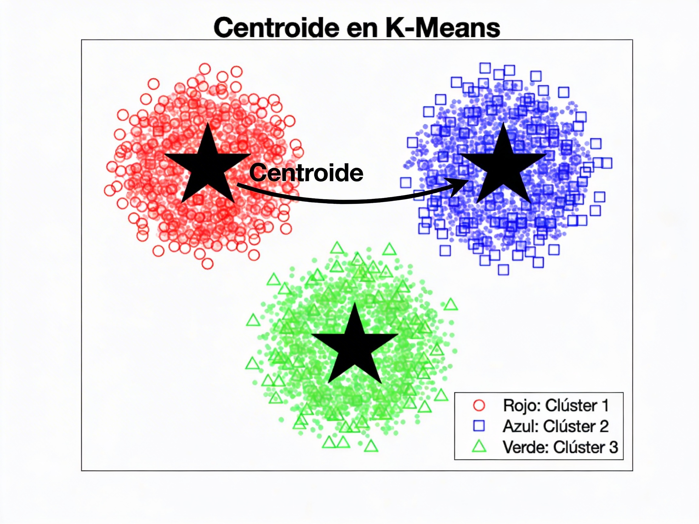
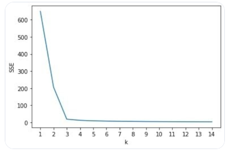
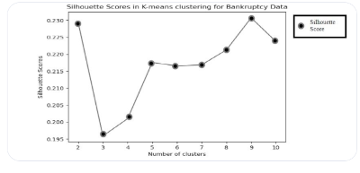
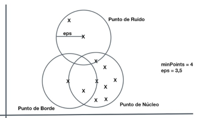

# Aprenentatge no supervisat

L'aprenentatge **no supervisat** és una part de l'aprenentatge automàtic que treballa amb dades sense etiquetar. És a dir, sabem les variables predictores però no hi ha variables objectius com a tal, ni etiquetes ni respostes predefinides. 

L'aprenentatge no supervisat ***no busca fer prediccions de valors*** sino descubrir estructures, patrons o representacions útils sense una eixida coneguda en principi. L'objectiu és comprendre l'organització intrínseca de les dades, realitzar classificacions, descobrir categories, anomalies o tendències i facilitar processos com visualització, reducció de dimensionalitat o segmentació.

## Tècniques principals

- **Agrupament (clustering)**
  - Objectiu: agrupar objectes similars entre sí i diferents respecte a altres grups.
  - Tècniques comunes: **K-means**, **clustering jeràrquic**, **DBSCAN**, **Gaussian Mixture Models**. Utilitzen distàncies o densitats per definir grups sense etiquetes prèvies.
  - Aplicacions: segmentació de clients, detecció de comunitats en grafos, anàlisi de patrons en imatges sense etiquetes.
- **Reducció de dimensionalitat**
  - Propòsit: reduir el nombre de trets mantenint la major informació possible.
  - Tècniques comunes: Anàlisi de Components Principals (PCA), t-SNE, UMAP, autoencoders.
  - Aplicacions: visualització 2D/3D de dades complexes, preprocesament per a mètodes supervisats quan hi ha poques etiquetes. Normalment complementa l'aprenentatge supervisat, on s'utilitza per reduir la grandària de les dades d'entrada abans d'aplicar un model.

Hi ha altres tècniques, però generalment són tipus especials de les anteriors:

- **Aprenentatge de representació (feature learning)**
  - Propòsit: descobrir representacions útils de les dades que capturen estructures subjacents. En general és una tècnica que va associada a la reducció de dimensionalitat.
  - Tècniques: models autoencoder simples o profunds, mètodes de factoració de matrius (p. ex., SVD), aprenentatge de característiques sense supervisió per millorar classificació futura.
- **Models de densitat i modelatge probabilístic**
  - Propòsit: estimar la distribució subjacent de les dades i descobrir estructures com agrupacions suaus. S'utilitza en tasques d'agrupament (clustering).
  - Tècniques: Gaussian Mixture Models, Models de Mescla de Densitat, Representacions basades en probabilitats.

De la reducció de dimensionalitat ja hem parlat al final de la unitat anterior, així que ens anem a centrar en tasques d'**agrupament** (clustering).

## Advantages i limitacions

- **Advantages**
  - No necessita etiquetes costoses; útil per a exploració inicial i generació d'hipòtesis.
  - Pot descobrir estructures no previstes per etiquetes humanes.
  - Competeix bé en escalabilitat quan s'implementen variants eficients (p. ex., mini-batch K-means).
- **Limitacions**
  - Interpretabilitat: els resultats poden ser ambigus i requereixen validació externa.
  - Selecció d'hiperparàmetres i mètriques d'avaluació no supervisades difícils de definir.
  - Risc de biaixos presents en les dades: si les dades d'entrada ja contenen biaixos, l'aprenentatge no supervisat els amplifica o els revela de forma no obvia.

## Aplicacions

Ja hem comentat més o menys quin tipus d'aplicació té l'aprenentatge no supervisat. Pel que fa a l'agrupament o clustering, les aplicacions més comunes inclouen:

- **Segmentació d'entitats**: agrupar entitats (clients, productes, etc.) amb comportaments similars per a classificació o tractament personalitzat.
- **Detecció d'anomalies**: identificar casos atípics en dades de transaccions financeres, sistemes de seguretat, fabricació de peces, etc.
- **Agrupament de documents**: organitzar grans col·leccions de textos sense etiquetar en temes o categories.
- **Anàlisi de patrons en imatges**: descobrir estructures o agrupacions en imatges sense etiquetes, com en la segmentació d'imatges o la detecció de característiques.
- **Reducció de dimensionalitat per a visualització**: projectar dades d'alta dimensionalitat a espais de menor dimensió per facilitar la visualització i la comprensió de les dades.

I moltes altres que es poden aplicar en àmbits com la biologia, la medicina, la ciència de materials, l'anàlisi de xarxes socials, etc.

## Algorismes principals

Els principals algorismes d'agrupament (clustering) inclouen:

- **K-means**: un algorisme de partició que divideix les dades en K grups basats en la distància als centròides.
- **Clustering jeràrquic**: construeix una jerarquia de grups mitjançant un enfocament ascendent (agglomeratiu) o descendent (divisiu).
- **DBSCAN**: un algorisme basat en densitat que identifica grups com a regions d'alta densitat separades per regions de baixa densitat.
- **Gaussian Mixture Models**: modela les dades com una combinació de distribucions gaussiana, permetent agrupacions suaus i superposades.  

### K-Means

L'algorisme K-Means és un dels mètodes més utilitzats per a realitzar clustering o agrupament de dades. La seua funció principal és dividir un conjunt de dades en K grups distints basats en la similitud de les seues característiques, sense necessitat de etiquetes prèvies. És com un model de classificació, però sense classes predefinides. Els grups es formen a partir de les dades mateixes.

**Com funciona**

El procés de K-Means és iteratiu i se basa en la distància entre els punts de dades i els **centròides** dels grups. Un **centròide** és el punt que representa el centre d'un grup i es calcula com la mitjana de les coordenades dels punts que pertanyen a eixe grup. 

L'algorisme segueix els següents passos:

- **Inicialització**: Es seleccionen K punts de dades com a centròides inicials. Esta selecció pot ser aleatòria o mitjançant mètodes de millora de la convergència.
- **Assignació**: Cada punt de dades es assigna al grup més proper basat en la distància al centròide (en general s'utilitza la distància euclidiana). Això crea K grups de dades.
- **Actualització**: Es recalculen els centròides de cada grup com la mitjana de les coordenades dels punts assignats a eixe grup.
- **Repetició**: Els passos d'assignació i actualització es repeteixen fins que els centròides no canvien significativament o s'arriba a una quantitat màxima d'iteracions.

**Objectiu**

L'objectiu de **K-Means** és minimitzar la variança dins de cada grup. Recordeu que la variança és la mitjana de la suma de les distàncies al quadrat de cada punt respecte a la mitjana. Eixa suma també és coneguda com a **inèrcia** o **suma de quadrats intra-grup (SEE)**. i s'utilitza com a mesura de la qualitat de l'agrupament. 

Això significa que el model busca formar grups on els punts estiguen el més a prop possible al seu centròide, creant agrupacions compactes i ben definides.

**Com triar la quantitat de grups (K)**

Hi ha diverses tècniques per determinar la quantitat òptima de grups en K-Means, i per tant el valor de K. Algunes de les més comunes són:

- **Mètode del colze (Elbow method)**: Es calcula la inèrcia (SSE) per a diferents valors de K i es busca el punt on la disminució de la inèrcia comença a ser menys pronunciada, formant un "colze" en la gràfica.

- **Mètode de la silueta (Silhouette method)**: Es calcula el coeficient de silueta per a diferents valors de K. El coeficient de silueta se calcula a partir de la distància mitjana d'un punt respecte a la resta de punts del mateix grup, i respecte als punts del grup més proper. Està entre -1 (mal assignat) i 1(ben assignat). Finalment se selecciona el valor de K que maximitza eixe valor (quan més prop a 1, millor), indicant una millor separació entre grups. S'utilitza si no hi ha un colze clar en la gràfica de l'Elbow method.

- **Mètode de la mitjana de distàncies (Gap statistic)**: Compara la inèrcia del model amb la inèrcia esperada amb una distribució aleatòria de les dades, seleccionant el valor de K que maximitza la diferència.

**Limitacions de K-Means**

K-Means, com tots els algorismes, té les seues limitacions.

- **Sensibilitat a la inicialització**: La selecció dels centròides inicials pot afectar significativament els resultats. Si els centròides es seleccionen de manera inadequada, el model pot convergir a un mínim local en lloc del mínim global, produint agrupaments subòptims. Per això, és comú executar K-Means diverses vegades amb diferents inicialitzacions i seleccionar el millor resultat.
- **Forma i mida dels grups**: K-Means assumeix que els grups són esfericos i de mida similar, ja que utilitza la distància euclidiana per a l'assignació. Si els grups tenen formes irregulars o diferents mides, K-Means pot no ser capaç de capturar adequadament l'estructura de les dades.
- **Sensibilitat a les dades atípiques (outliers)**: K-Means és sensible a les dades atípiques (outliers). Com que tot funciona basant-se en valors mitjans, els punts que estan molt lluny de la mitjana afecten al bon funcionament dels custers. Això pot distorsionar els grups i produir resultats no representatius.
- **Requereix especificar K**: K-Means necessita que l'usuari especifique la quantitat de grups (K) abans de l'execució, el que pot ser difícil si no es té una idea clara de l'estructura de les dades. Tot i que hi ha tècniques per ajudar a determinar K, no sempre és fàcil trobar un valor òptim.

**Implementació en Python**

Normalment s'utilitza la mateixa llibreria que ja coneguem, `scikit-learn`, que té una implementació molt eficient de K-Means. Permet ajustar el paràmetre `n_init` per a realitzar múltiples inicialitzacions i seleccionar la millor solució, i també el paràmetre `init` per a triar el mètode d'inicialització (com `k-means++` que millora la convergència).

> En quaderns annexos veurem com implementar K-Means en Python

#### DBSCAN

**DBSCAN** (Density-Based Spatial Clustering of Applications with Noise) és un algorisme de clustering basat en densitat que identifica grups com a regions d'alta densitat separades per regions de baixa densitat. És especialment útil per a dades amb formes arbitràries i per a la detecció d'anomalies, ja que no se basa en un punt central sino en la forma en què les dades es distribueixen en l'espai.

**Com funciona**

DBSCAN utilitza dos paràmetres principals: `eps` (la distància màxima entre punts per considerar-los veïns) i `min_samples` (la quantitat mínima de punts necessaris per formar un cluster).  

L'algorisme analitza cada punt i el classifica com a:

- **Punt central (core point)**: Si té almenys `min_samples` punts dins de la distància `eps`, és un punt central i forma part d'un cluster.
- **Punt de vora (border point)**: Si té menys de `min_samples` punts dins de `eps` però està dins de la distància `eps` d'un punt central, és un punt de vora i també forma part del cluster.
- **Punt de soroll (noise point)**: Si no és un punt central ni un punt de vora, es considera soroll (outlier) i no pertany a cap cluster.

**Avantatges de DBSCAN**

- No cal especificar la quantitat de clusters (K) prèviament, ja que els clusters es formen basant-se en la densitat de les dades.
- Pot identificar clusters de formes arbitràries, a diferència de K-Means que assumeix clusters esfèrics.
- Detecta automàticament els punts de soroll (outliers), cosa que el fa útil per a dades amb anomalies.

**Limitacions de DBSCAN**

- **Densitats variables**: DBSCAN pot tindre dificultats per a identificar clusters si les densitats varien significativament, ja que utilitza un paràmetre `eps` fix per a tots els clusters.
- **Sensibilitat als paràmetres**: La selecció dels paràmetres `eps` i `min_samples` pot ser complicada i pot afectar significativament els resultats. No hi ha una regla clara per a triar aquests paràmetres, i moltes vegades cal fer diferents proves.
- **No funciona bé amb dades d'alta dimensionalitat**: La distància entre punts es torna menys significativa en espais de moltes dimensions (mal de la dimensionalitat).

**Triar els paràmetres**

No hi ha una regla clara, com hem comentat, però podem seguir certes pautes:

- Per a `eps`, es pot utilitzar un gràfic de distàncies k-ésimes (***k-distance graph***) per a identificar un punt d'inflexió que sugerisca un valor adequat.
- Per a `min_samples`, una regla general és utilitzar un valor major o igual a la dimensió de les dades + 1. Si hi ha molts outliers, duplicar el seu valor.

**Implementació en Python**

També s'utilitza `scikit-learn` per a implementar DBSCAN, que permet ajustar els paràmetres `eps` i `min_samples` de manera senzilla. A més, proporciona una etiqueta de -1 per als punts de soroll, facilitant la identificació d'anomalies en les dades.

> En quaderns annexos veurem com implementar també DBSCAN en Python

#### Clustering jeràrquic

L'algorisme de **clustering jeràrquic** construeix una jerarquia de grups mitjançant un enfocament ascendent (aglomeratiu o ***bottom-up***) o descendent (divisiu o ***top-down***). En el clustering jeràrquic agglomeratiu, cada punt comença com un cluster individual i es van fusionant els clusters més propers fins a formar un únic cluster que conté totes les dades. En el clustering jeràrquic divisiu, es comença amb un únic cluster que conté totes les dades i es va dividint en subclusters fins a obtenir clusters individuals.

No necessita establir la quantitat de clusters prèviament, ja que es pot tallar la jerarquia en qualsevol nivell per obtenir el nombre desitjat de clusters. La distància entre els clusters es pot calcular de diverses maneres, com la distància mínima (single linkage), la distància màxima (complete linkage) o la distància mitjana (average linkage).

Com que té forma d'arbre, es pot visualitzar mitjançant un diagrama de dendrograma, que mostra com es fusionen o divideixen els clusters a mesura que es recorre la jerarquia. Per això, és fàcilment interpretable.

El **clustering jeràrquic** és més costós computacionalment que K-Means, especialment per a grans conjunts de dades.

#### Gaussian Mixture Models

La principal diferència dels GMM respecte a altres mètodes és que un punt té una probabilitat de pertànyer a cada cluster, en lloc de ser assignat a un únic cluster. Això permet que els clusters es superposen i que els punts puguen pertànyer a múltiples clusters amb diferents graus de pertinença. Per això se considera un model de clustering suau (***soft clustering***), a diferència de K-Means que és un model de clustering dur (***hard clustering***).

GMM és més flexible que K-Means, ja que pot modelar clusters de formes arbitràries. És per tant útil quan les fronteres entre clusters no estan clarament definides. D'altra banda, com que és un model probabilístic, pot ser més sensible a la inicialització i pot requerir més iteracions per a convergir.